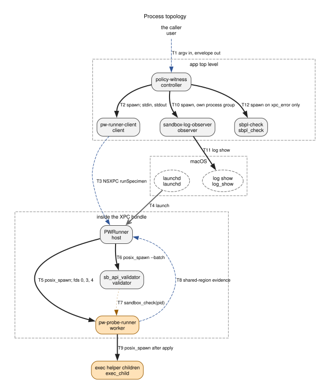
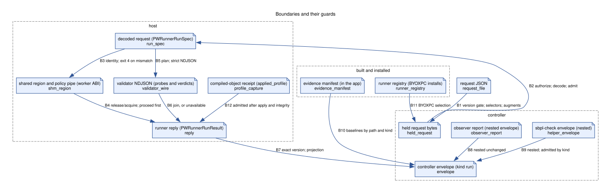
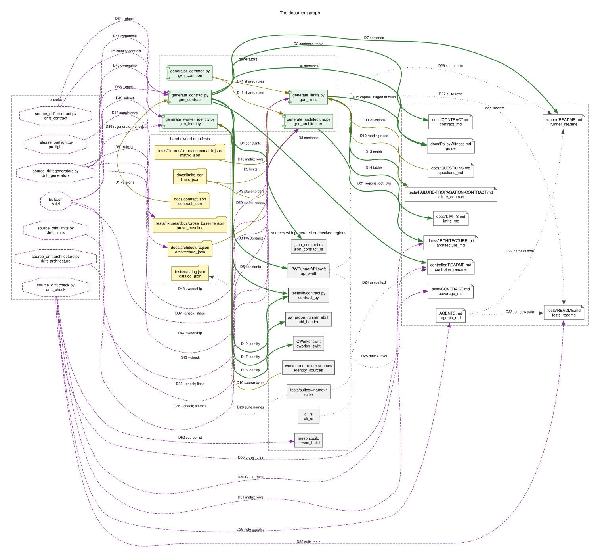
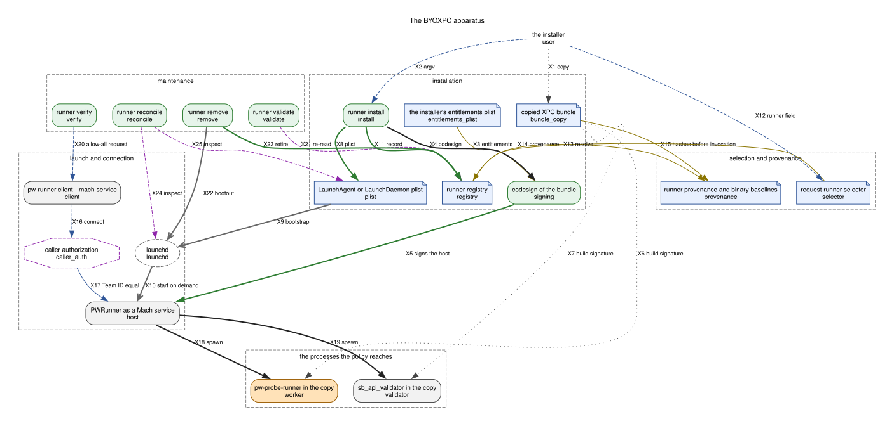

# PolicyWitness architecture

A tour of the internals at the level between the [README](../README.md)'s
Flow paragraph and the directory READMEs: how one run unfolds in time and the
boundaries it crosses. It is for a developer or agent who has read the README
and is about to open a directory. It is not a field reference, a contract, a
module list, a test map or a build guide; each of those exists and is linked
from the section that would otherwise restate it.

The <!-- span architecture.graphs -->4<!-- /span --> figures are generated from [architecture.json](architecture.json)
by [generate_architecture.py](generate_architecture.py). Every node and edge in
a figure has an id, and the table beside the figure names, for that id, the
source symbol that implements it and the test or rule the manifest names. The
generator verifies symbol presence and test definition; a
citation is a place to look, not a proof that the test asserts the whole
row. A node or edge is chased by its id, not by prose. The one figure that
is not a graph, the run timeline, is drawn by hand below and cites its
sources the same way. Behavior that falls short of a stated promise is
written where the promise is stated, in a paragraph that opens with "Known
gap", and indexed in the [last section](#known-gaps).

## Why these processes exist

Two facts about the macOS sandbox shape everything. `sandbox_check` answers
for a live process, and `sandbox_apply` is one-way: a process that has applied
a profile cannot shed it. A specimen therefore needs a process that applies
the policy and then stays alive long enough to be queried and to attempt
things, and that process cannot serve the next specimen. PolicyWitness spawns
one worker per specimen, applies the policy inside it, and queries it from
outside.

The reply path must stay outside the policy under test. A `(deny default)`
profile can deny the worker's own writes and even its exit, so the worker
never reports over a pipe after applying. It publishes into a shared region
the host mapped and pre-touched before the spawn, and the host, which never
applies anything, assembles the reply. The same split makes the worker's exit
status the source of truth about what happened to it, which is what the
[disposition record](../tests/FAILURE-PROPAGATION-CONTRACT.md#worker-disposition-record)
is built from.

The host is an XPC service that launchd starts for one specimen and that exits
shortly after replying, so no host state outlives a run. The controller is a
separate process so that an envelope is printed whatever the host does,
including never answering. The controller is Rust and `NSXPCConnection` is an
Objective-C API, so a small Swift client owns the connection
([why the launcher shells out](../controller/README.md#why-the-rust-launcher-still-shells-out)).

The validator is its own process so that `sandbox_check` runs unsandboxed
against the worker's PID while the worker is held between applying and
attempting. The observer runs the unified-log query in its own process group
under a budget, so a stalled `log show` is cut off and cleaned up without
touching execution evidence
([log collection budgets](../controller/README.md#log-collection-budgets-and-cleanup)).
`sbpl-check` compiles the policy in the controller's own context when the
client reported the runner unreachable (`xpc_error`), so the envelope still
carries a compile diagnostic, which matters inside an
[automation sandbox](../AGENTS.md#sandboxed-automation-harnesses). It
establishes nothing about how far a host or worker progressed before the
connection failed.

Only the worker (compile and apply), the validator (`sandbox_check`) and
`sbpl-check` (compile only) call native sandbox APIs; the topology table's
Native sandbox API column is the record. The controller, the client, the
host and the observer do not, and for the host
that is enforced rather than assumed (see [Principles](#principles-as-enforced-constraints)).

## Process topology

Who starts whom, over what channel, with what lifetime. Locations are given
at the granularity of "app top level" and "inside the XPC bundle"; the exact
bundle paths are the contract in the README's
[What ships](../README.md#what-ships). The C worker and the validator sit
inside the XPC bundle so that the built-in runner and a BYOXPC copy each
resolve their own helpers relative to their own bundle.

<!-- BEGIN GENERATED ARCHITECTURE GRAPH topology -->


*Figure: process topology. Generated from [architecture.json](architecture.json) by [generate_architecture.py](generate_architecture.py); dot source in [architecture-topology.dot](architecture-topology.dot). The ids in the figure are the ids in the tables below, and each row cites the source symbol that implements it and the test or rule the manifest names for it. Symbol presence and test definition are verified; whether a test asserts the row is not verified.*

<details>
<summary>Process topology: 11 nodes and 12 edges, with symbol presence and test definition verified; whether a test asserts the row is not verified</summary>

#### Process topology nodes

| Id | Node | Kind | Where | Lifetime | Language | Started by | Sandboxed | Native sandbox API | Sources | Checks | Limits |
| --- | --- | --- | --- | --- | --- | --- | --- | --- | --- | --- | --- |
| user | the caller | person | a shell or a harness | owns the request file and reads the envelope |  |  |  |  | [`pub fn run`](../controller/src/cli.rs) | [`check_cli_surface_agreement`](../tests/suites/source_drift/check.py) |  |
| controller | policy-witness | executable | app top level | one run | Rust | the caller | no | none | [`fn main`](../controller/src/main.rs); [`cmd_run`](../controller/src/run_flow.rs) | [`consumer_controls`](../tests/suites/blackbox_e2e/checker_controls.py); [`inventory`](../tests/lib/artifact.py) |  |
| client | pw-runner-client | executable | app top level | one run | Swift | the controller | no | none | [`readDataToEndOfFile`](../runner/Clients/PWRunnerClient/main.swift); [`NSXPCConnection`](../runner/Clients/PWRunnerClient/main.swift) | [`path_wire_fixtures_survive_capture_serialization_and_independent_consumer`](../controller/src/runner_client.rs); [`client_output_control`](../tests/suites/blackbox_e2e/checker_controls.py) |  |
| host | PWRunner | executable | inside the XPC bundle | one specimen; exits 50 milliseconds after replying | Swift | launchd: XPC service lookup, or a Mach service for BYOXPC | no | none, by the invariance rule | [`NSXPCListener.service()`](../runner/Services/PWRunner/main.swift); [`runSpecimen`](../runner/Sources/PWRunnerCore/PWRunnerService.swift); [`hostExitDelayMs`](../runner/Sources/PWRunnerCore/PWRunnerService.swift) | [`inspect`](../tests/lib/artifact.py); [`check_host_invariance`](../tests/suites/source_drift/check.py); [`runServiceAdmissionTests`](../runner/Tests/PWRunnerCoreTests/ServiceAdmissionTests.swift); [`single_use`](../tests/suites/runner_byoxpc/opt_in/single_use.sh) | [`host_exit_delay`](LIMITS.md#execution-budgets) |
| worker | pw-probe-runner | sandboxed | inside the XPC bundle | until the host requests exit; spins after done | C | the host | yes; applies the specimen policy to itself | sandbox_compile_string, params, sandbox_apply | [`sandbox_compile_string`](../controller/tools/pw_probe_runner/pw_probe_runner.c); [`sandbox_apply`](../controller/tools/pw_probe_runner/pw_probe_runner.c) | [`exec_control_states`](../tests/suites/runner_c_worker_harness/run.sh); [`happy_default_allow`](../tests/suites/runner_use_c_worker/run.sh) |  |
| exec_child | exec helper children | sandboxed | the caller's path | the worker's waits are bounded by the exec deadline and the attempt budget; a descendant that leaves the child's process group is not contained | caller-supplied | the worker | inherit the worker's sandbox | none of PolicyWitness's | [`attempt_exec_spawn`](../controller/tools/pw_probe_runner/pw_probe_runner.c); [`exec_resources_acquire`](../controller/tools/pw_probe_runner/pw_probe_runner.c) | [`timeout_preserves_output_and_continues`](../tests/suites/runner_exec_lifecycle/run.sh); [`contaminated_worker`](../tests/suites/runner_exec_inheritance/run.sh) |  |
| validator | sb_api_validator | executable | inside the XPC bundle | one batch | C | the host, after applied | no | sandbox_check | [`sandbox_check`](../controller/tools/sb_api_validator/sb_api_validator.c); [`SANDBOX_CHECK_NO_REPORT`](../controller/tools/sb_api_validator/sb_api_validator.c); [`runValidator`](../runner/Sources/PWRunnerCore/ValidatorClient.swift) | [`predictions_do_not_report`](../tests/suites/validator_batch_mode/run.sh); [`bothBinariesExist`](../runner/Tests/PWRunnerCoreTests/CWorkerValidatorTests.swift) |  |
| observer | sandbox-log-observer | executable | app top level | one scan | Rust | the controller, after execution completes, in its own process group | no | none | [`capture_sandbox_logs_with_timeout`](../controller/src/sandbox_log.rs); [`process_group`](../controller/src/log_capture.rs) | [`parsed_event_retains_pid_operation_and_raw_line_without_temporal_claims`](../controller/src/bin/sandbox-log-observer.rs); [`checked_reads`](../tests/suites/witness_contract/check_deny_capture_window.py) |  |
| log_show | log show | os | /usr/bin/log | one query | OS | the observer | no | none | [`Command::new("/usr/bin/log")`](../controller/src/bin/sandbox-log-observer.rs) | [`both_raw_streams_are_bounded_at_exact_edges`](../controller/src/log_capture.rs) |  |
| sbpl_check | sbpl-check | executable | app top level | one compile | Rust | the controller, only for an admitted xpc_error reply | no | sandbox_compile_string and params; never applies | [`sandbox_compile_string`](../controller/src/bin/sbpl-check.rs); [`run_policy_check`](../controller/src/policy_check.rs) | [`fallback_compilation_is_requested_only_for_an_admitted_xpc_error`](../controller/src/run_flow.rs) |  |
| launchd | launchd | os | system |  | OS |  | no | none | [`NSXPCListener(machServiceName:`](../runner/Services/PWRunner/main.swift); [`MachServices`](../controller/src/runner_manager.rs) | [`pwrunner_survives_mach_service_launch`](../tests/suites/runner_mach_service_liveness/run.sh); [`runner_install`](../tests/suites/runner_byoxpc/run.sh) |  |

#### Process topology edges

| Id | From | To | Kind | Edge | Sources | Checks | Limits |
| --- | --- | --- | --- | --- | --- | --- | --- |
| T1 | user | controller | channel | argv in; one JSON envelope on stdout | [`pub fn run`](../controller/src/cli.rs); [`print_envelope`](../controller/src/json_contract.rs) | [`check_cli_surface_agreement`](../tests/suites/source_drift/check.py); [`envelope_shape_golden_agrees_with_the_manifest`](../controller/src/run_flow.rs) |  |
| T2 | controller | client | spawn | spawn; held request on stdin, read to EOF; reply on stdout | [`run_pw_runner_client`](../controller/src/runner_client.rs); [`readDataToEndOfFile`](../runner/Clients/PWRunnerClient/main.swift) | [`path_wire_fixtures_survive_capture_serialization_and_independent_consumer`](../controller/src/runner_client.rs); [`client_output_control`](../tests/suites/blackbox_e2e/checker_controls.py) |  |
| T3 | client | host | channel | NSXPC runSpecimen(Data) and its reply | [`NSXPCConnection`](../runner/Clients/PWRunnerClient/main.swift); [`runSpecimen`](../runner/Sources/PWRunnerCore/PWRunnerService.swift); [`authorizedCaller`](../runner/Sources/PWRunnerCore/PWRunnerService.swift) | [`happy_default_allow`](../tests/suites/runner_use_c_worker/run.sh); [`accepted_input_contract`](../tests/suites/runner_outcome_bad_request/run.sh) |  |
| T4 | launchd | host | launch | start on XPC lookup, or as a Mach service (BYOXPC) | [`NSXPCListener.service()`](../runner/Services/PWRunner/main.swift); [`NSXPCListener(machServiceName:`](../runner/Services/PWRunner/main.swift); [`launchctl_bootstrap`](../controller/src/runner_manager.rs) | [`pwrunner_survives_mach_service_launch`](../tests/suites/runner_mach_service_liveness/run.sh); [`runner_install`](../tests/suites/runner_byoxpc/run.sh) |  |
| T5 | host | worker | spawn | posix_spawn; fd 0 policy pipe, fd 3 shared region, fd 4 ready pipe | [`posix_spawn_file_actions_adddup2`](../runner/Sources/PWRunnerCore/CWorker.swift); [`F_SETNOSIGPIPE`](../runner/Sources/PWRunnerCore/CWorker.swift); [`writePolicy`](../runner/Sources/PWRunnerCore/MonotonicDeadline.swift); [`PW_SHM_ABI_MAGIC`](../controller/tools/pw_probe_runner/pw_probe_runner_abi.h) | [`c_swift_layout_agreement`](../tests/suites/runner_abi_layout/run.sh); [`exec_control_states`](../tests/suites/runner_c_worker_harness/run.sh); [`runPolicyTransferTests`](../runner/Tests/PWRunnerCoreTests/PolicyTransferTests.swift) |  |
| T6 | host | validator | spawn | posix_spawn --batch <pid>; NDJSON probes in, verdicts out | [`runValidator`](../runner/Sources/PWRunnerCore/ValidatorClient.swift); [`decodeValidatorFrames`](../runner/Sources/PWRunnerCore/ValidatorClient.swift) | [`predictions_do_not_report`](../tests/suites/validator_batch_mode/run.sh); [`transcript_controls`](../tests/suites/runner_validator_failure/run.sh) |  |
| T7 | validator | worker | native | sandbox_check against the worker PID, with SANDBOX_CHECK_NO_REPORT | [`sandbox_check`](../controller/tools/sb_api_validator/sb_api_validator.c); [`SANDBOX_CHECK_NO_REPORT`](../controller/tools/sb_api_validator/sb_api_validator.c) | [`predictions_do_not_report`](../tests/suites/validator_batch_mode/run.sh); [`independent_worker_and_host_queries`](../tests/suites/runner_live_worker_identity/run.sh) |  |
| T8 | worker | host | channel | evidence published in the shared region with release ordering; proceed waited for before attempts | [`wait_for_proceed`](../controller/tools/pw_probe_runner/pw_probe_runner.c); [`run_attempt`](../controller/tools/pw_probe_runner/pw_probe_runner.c); [`CWorkerStepResult`](../runner/Sources/PWRunnerCore/CWorker.swift); [`proceedOffset`](../runner/Sources/PWRunnerCore/CWorker.swift) | [`signal_while_waiting`](../runner/Tests/PWRunnerCoreTests/OrderingTests.swift); [`order_barrier_mutations`](../tests/suites/witness_contract/opt_in/mutations.sh) |  |
| T9 | worker | exec_child | spawn | posix_spawn after apply; stdout and stderr pipes into bounded slot buffers | [`attempt_exec_spawn`](../controller/tools/pw_probe_runner/pw_probe_runner.c); [`exec_resources_acquire`](../controller/tools/pw_probe_runner/pw_probe_runner.c) | [`timeout_preserves_output_and_continues`](../tests/suites/runner_exec_lifecycle/run.sh); [`exec_control_states`](../tests/suites/runner_c_worker_harness/run.sh) |  |
| T10 | controller | observer | spawn | spawn in its own process group after execution; budget on argv; JSON report on stdout | [`capture_sandbox_logs_with_timeout`](../controller/src/sandbox_log.rs); [`capture_with_ops`](../controller/src/log_capture.rs); [`process_group`](../controller/src/log_capture.rs) | [`both_raw_streams_are_bounded_at_exact_edges`](../controller/src/log_capture.rs); [`checked_reads`](../tests/suites/witness_contract/check_deny_capture_window.py) |  |
| T11 | observer | log_show | spawn | log show over the padded client span; text on stdout, bounded | [`Command::new("/usr/bin/log")`](../controller/src/bin/sandbox-log-observer.rs); [`capture_sandbox_logs_with_timeout`](../controller/src/sandbox_log.rs) | [`run_span_window_floors_start_ceils_end_and_never_collapses`](../controller/src/sandbox_log.rs); [`both_raw_streams_are_bounded_at_exact_edges`](../controller/src/log_capture.rs) |  |
| T12 | controller | sbpl_check | spawn | spawn only for an admitted xpc_error reply; held request in; helper envelope out | [`fallback_policy_check`](../controller/src/run_flow.rs); [`run_policy_check`](../controller/src/policy_check.rs) | [`fallback_compilation_is_requested_only_for_an_admitted_xpc_error`](../controller/src/run_flow.rs); [`refused_reply_versions_request_no_fallback_compilation`](../controller/src/run_flow.rs) |  |

Notes:

- `host`: All authorized connections share one terminal, locked request claim. Only its owner schedules host exit; connections racing retirement can still fail before refusal.
- `T5`: Policy delivery uses nonblocking writes under one absolute monotonic deadline (the worker_policy_transfer limit) beginning after spawn. Expiry closes input and enters cleanup before readiness or sentinel polling.

Every node and edge above cites at least one test or rule.

</details>
<!-- END GENERATED ARCHITECTURE GRAPH topology -->

## One run in time

The spine of the architecture is temporal. The host releases the worker's
attempts only after the validator's collection has closed, so every
prediction is made before any attempt is tried; that interval is the only
thing `comparison.order: "query_first"` claims
([the record](../tests/FAILURE-PROPAGATION-CONTRACT.md#the-record)). The
timeline below is the host driver's step list in
[CWorker.swift](../runner/Sources/PWRunnerCore/CWorker.swift), the worker's
[`main`](../controller/tools/pw_probe_runner/pw_probe_runner.c) in
pw_probe_runner.c and
the controller's [`run`](../controller/src/run_flow.rs) in run_flow.rs, laid
side by side.

```text
controller / client            host (PWRunner)                  worker (pw-probe-runner)      validator
-------------------            ---------------                  ------------------------      ---------
read the request; version
gate; select the runner;
resolve augments; dossier;
strip selectors; serialize
the held bytes once
   |
   | client reads stdin to
   | EOF, then NSXPC
   | runSpecimen(Data)
   |-------------------------->| accept only an authorized caller
                               | decode with closed keys; capacity,
                               | then meaning; policy hash
                               | plan validator queries: drop pairs that
                               | cannot be predicted and paths that do
                               | not resolve on the host now
                               | zero the region; identity, counts,
                               | slots, params; pre-touch; prepared=1
                               | ready + policy pipes (CLOEXEC, NOSIGPIPE)
                               |-- posix_spawn, fds 0/3/4 -------->| map the region; refuse on magic
                               |-- policy bytes on fd 0 ---------->| or identity mismatch (exit 4);
                               |                                   | read the policy to EOF; params;
                               |                                   | compile; if asked, copy the compiled
                               |                                   | object into the capture region
                               |<--------- ready byte (fd 4) ------|
                               |                                   | sandbox_apply; applied=1
                               | acquire applied (apply_rc 0,      |
                               | identity match)                   |
                               |-- posix_spawn --batch <pid> --------------------------------->|
                               |-- probes on stdin ------------------------------------------->| sandbox_check
                               |<--------------------------------------------- verdicts (NDJSON)| per probe
                               | hook returns; collection closed;  |
                               | proceed=1 (release)               |
                               |                                   | wait_for_proceed (budget;
                               |                                   | failure code 8 on expiry)
                               |                                   | proceed_observed=1
                               |                                   | attempts in plan order; exec
                               |                                   | children are spawned here;
                               |                                   | completed=1 per slot (release)
                               |                                   | done=1; spin
                               | poll: done, reaped, sentinel      |
                               | deadline, or wait error           |
                               | exit_requested=1 ---------------->| _exit(0)
                               | grace; SIGKILL fallback; waitpid  |
                               | final acquire snapshot; decode
                               | evidence; classify; disposition
                               | record; ordering; per-step query,
                               | attempt and comparison; encode,
                               | degrading if the reply cannot be
                               | built
   |<--------------------------| reply; exit 50 ms later
   | admit the reply version
   | sbpl-check, only for xpc_error
   | complete execution (the
   | disposition projection)
   | observer over the padded client
   | span, in its own process group,
   | runs log show; correlation
   | envelope on stdout
```

Where each phase is pinned:

- **Controller admission and selection.** [`run`](../controller/src/run_flow.rs) in
  run_flow.rs: the manifest is loaded once,
  then `parse_request`, `validate_request_version`, selector parsing,
  `resolve_runner_target_with_registry`, `resolve_augments`, the dossier, and
  `strip_runner_selector` before the held bytes are serialized. Checked by the
  `orchestration` tests in the same file.
- **Caller authorization.** [`authorizedCaller`](../runner/Sources/PWRunnerCore/PWRunnerService.swift) runs when the connection is
  accepted, before any request is read.
- **Host admission.** `runSpecimen` decodes with closed keys, then
  `admissionFailure(for:)` (capacity), `requestMeaningFailure` (meaning) and
  `computePolicyHash`, in that order; a refusal replies without spawning
  anything. Checked by `runner_outcome_bad_request` and `failure_boundaries`.
- **Query planning.** `planValidatorQueries` runs before the spawn. It drops
  a query whose operation and filter pair cannot be predicted, and a path
  query whose target does not resolve on the host at that moment
  (`path_unresolved_at_planning`); the decision holds for the run even if an
  attempt later creates or removes the target, and the step still receives
  an explicit `prediction_unavailable` observation. Checked by `runner_unit`
  and the planner rule in `source_drift`.
- **Spawn and apply.** The driver's header comment in
  [CWorker.swift](../runner/Sources/PWRunnerCore/CWorker.swift) from the
  region setup through the ready byte, and the worker's from mapping the
  region through apply. The ready byte has its own window
  (`readyByteTimeoutMs`); `runner_ready_byte_resilience` checks it.
- **Compiled-object receipt.** When the request opts in, the worker copies
  the compiled object into the capture region before applying it
  (`pw_capture_profile`). The host admits that copy only after successful
  application, worker completion, PID, nonce, input identity and payload
  integrity checks (`decodeProfileCapture`); the
  [guide](PolicyWitness.md#compiled-object-receipt-opt-in) distinguishes it
  from a kernel readback. Checked by `AppliedProfileCaptureTests`.
- **The barrier.** The validator runs inside the [`postApplied`](../runner/Sources/PWRunnerCore/CWorkerOrchestrator.swift) hook of
  CWorkerOrchestrator.swift
  with the worker's PID, or not at all when no step has a predictable
  query. `proceed` is stored when the hook returns; the worker's
  `wait_for_proceed` refuses to attempt anything before it. `PWRunnerOrdering`
  records what was observed. Checked by `OrderingTests` and the opt-in
  `witness_contract/order_barrier_mutations` control
  ([OPT_IN_TESTS.md](../tests/OPT_IN_TESTS.md)).
- **Attempts and publication.** `run_attempt` writes each slot and releases
  `completed`; an exec attempt acquires its pipes and spawn handles after
  apply and releases them before its slot completes. Checked by
  `runner_c_worker_harness` and `runner_exec_lifecycle`.
- **Exit, grace and kill.** The driver's header comment from the exit
  request through the final snapshot;
  `runner_outcome_runner_timeout/host_kills_hung_worker` checks the kill path
  and `runner_use_c_worker` the ordinary one.
- **Reply and envelope.** `reply_version` admits the reply or retains it
  unread; `fallback_policy_check` runs only for an admitted `xpc_error`;
  `complete_execution` projects the disposition; `attach_sandbox_logs` adds
  log evidence without touching execution fields. Checked by the Rust unit
  tests named in the boundary tables below.

What a reply does not establish: the client's timeout ends the controller's
wait and yields a synthetic `xpc_timeout` reply, and it cancels nothing in
the host. The host's cleanup can fail: `terminate` makes one blocking wait
after a successful kill request, and when no reap is confirmed the
collection basis reads `execution_may_continue` rather than
`after_confirmed_reap`. The
[failure evidence contract](../tests/FAILURE-PROPAGATION-CONTRACT.md#host-observations)
adds no global lifecycle deadline, so a reply, the end of observation and
the end of execution are three different moments, and each record says
which one it describes.

Known gap: an exec child's descendant that leaves the child's process group
is not contained. The worker kills the group at the exec deadline and at
cleanup, and the lifecycle record says what it observed, but a process that
has left the group outlives the run unseen, and no record establishes that
every descendant stopped.

Each budget covers one phase and no more. Policy delivery has its own
absolute monotonic deadline, [`worker_policy_transfer`](LIMITS.md#execution-budgets),
started immediately after the spawn; the ready window,
[`worker_ready_wait`](LIMITS.md#execution-budgets), covers only the wait for the
ready byte after the policy has been written; the sentinel deadline,
[`worker_sentinel_wait`](LIMITS.md#execution-budgets), covers application through
`done`, less the collection interval, because the host runs the hook
synchronously between polls and the hook's time is outside it; the
validator I/O deadline, [`validator_io_wait`](LIMITS.md#execution-budgets), covers
collection; the proceed budget, [`worker_proceed_wait`](LIMITS.md#execution-budgets),
covers the worker's wait for release; the grace timer,
[`worker_exit_grace`](LIMITS.md#execution-budgets), covers exit request to kill; the
exec deadline and attempt budget, [`exec_child_wait`](LIMITS.md#execution-budgets) and
[`exec_attempt_budget`](LIMITS.md#execution-budgets), cover the worker's waits on exec
children, per step and per plan; the log budget,
[`log_collection_timeout`](LIMITS.md#evidence-capture), covers the observer.
The ready and sentinel budgets are iteration counts over a sleep interval,
not wall-clock guarantees in either direction. Their values and their
checks are in [LIMITS.md](LIMITS.md).

The host sends policy bytes through a nonblocking pipe under the delivery
deadline ([`writePolicy`](../runner/Sources/PWRunnerCore/MonotonicDeadline.swift) and [`MonotonicDeadline`](../runner/Sources/PWRunnerCore/MonotonicDeadline.swift) in
MonotonicDeadline.swift).
Partial writes, interruptions and backpressure consume the same allowance.
Expiry records `policy_transfer_timeout` separately from any write errno,
closes input and enters cleanup without starting readiness or sentinel polling.
Counts describe accepted writes, not child receipt. `PolicyTransferTests`
checks a stalled reader, exact draining delivery, deadline edge cases and
cleanup failures; the actual driver replies pass through controller assembly
and the independent consumer. The deadline does not bound final reap or cancel
an earlier client timeout.

## Evidence channels and ownership

The channels that reach the envelope are tabulated below. Each native result has one writer. The
host adds its own observations beside a native result and overwrites none of
them, and the controller does the same with the host's.

| Channel | Native result written by | Host adds | Where it lands | What it is |
| --- | --- | --- | --- | --- |
| Prediction | the validator | an explicit `prediction_unavailable` observation for a step the planner excluded; path diagnostics after orchestration | `steps[].sandbox_check` | one `sandbox_check` verdict per predicted step |
| Attempt | the worker, through the shared region | the lifecycle copies; path diagnostics after orchestration | `steps[].attempt` | the attempted operation's own result, with `rc` and `errno` |
| Comparison | the host | nothing further | `steps[].comparison` | the attempt's classified observation, the submitted-scope relations, the order established, and the limitations |
| Disposition | the host, from raw facts it cites | the controller's projection | `runner_subprocess.disposition`; `data.runner_sandbox_diagnostics` (execution fields) | what happened to the worker process, answered only from the cited facts |
| Compiled-object receipt | the worker, before apply, when asked | admission after application, completion, PID, nonce and integrity checks | `applied_profile` | a copy of the compiled object; not a kernel readback |
| Dossier | the controller | nothing further | `data.specimen` | the request as submitted, augmentation and imports, host facts, runner and app provenance, binary hashes observed before invocation |
| Log capture | the observer | the controller's correlation fields | `data.sandbox_log_capture`; `data.runner_sandbox_diagnostics` (log fields) | deny records the unified log showed in the padded window, with candidate associations; never a verdict |

The rule that holds the channels apart: log evidence never changes execution
evidence. The assembly seam is [`attach_sandbox_logs`](../controller/src/run_flow.rs) in
run_flow.rs, where the collector receives
read-only execution evidence and returns only log-owned fields; the unit test
`collector_states_preserve_the_serialized_execution_half` checks it, and the
controller README's
[ownership table](../controller/README.md#execution-and-log-evidence-ownership)
names the owner of every field. The host's additions are
[`enrichPathDiagnostics`](../runner/Sources/PWRunnerCore/PWRunnerService.swift) in
PWRunnerService.swift
and the planner's synthesized observations in
[CWorkerOrchestrator.swift](../runner/Sources/PWRunnerCore/CWorkerOrchestrator.swift).
No record asserts agreement or disagreement between the prediction and
attempt channels; the reading rules for the comparison record are in the
[failure evidence contract](../tests/FAILURE-PROPAGATION-CONTRACT.md#comparison-record).
The normative semantics of the reply live in that contract, under `tests/`;
this document links it wherever it needs a rule and never restates one.

## Boundaries

Each node below is a record that crosses from one owner to another, and each
edge is the guard that lets it cross. [contract.json](contract.json) owns the
wire version numbers and the build generates one source identity
([CONTRACT.md](CONTRACT.md)). The records that carry a local version field
of their own, each read by exactly one receiver, are the observer report,
the evidence manifest, the runner registry and the compiled-object receipt,
and the node table's Form column names each one's field. Every other
boundary is held by a golden, a suite, or by being built and shipped
together, and the edge table says which.

<!-- BEGIN GENERATED ARCHITECTURE GRAPH boundaries -->


*Figure: boundaries and their guards. Generated from [architecture.json](architecture.json) by [generate_architecture.py](generate_architecture.py); dot source in [architecture-boundaries.dot](architecture-boundaries.dot). The ids in the figure are the ids in the tables below, and each row cites the source symbol that implements it and the test or rule the manifest names for it. Symbol presence and test definition are verified; whether a test asserts the row is not verified.*

<details>
<summary>Boundaries and their guards: 12 nodes and 12 edges, with symbol presence and test definition verified; whether a test asserts the row is not verified</summary>

#### Boundaries and their guards nodes

| Id | Node | Kind | Owner | Form | Sources | Checks | Limits |
| --- | --- | --- | --- | --- | --- | --- | --- |
| request_file | request JSON | record | the caller | a JSON file naming the request schema | [`parse_request`](../controller/src/request_patch.rs) | [`accepted_input_contract`](../tests/suites/runner_outcome_bad_request/run.sh) |  |
| held_request | held request bytes | record | the controller | one serialization; selectors stripped, augments spliced | [`strip_runner_selector`](../controller/src/runner_select.rs); [`pub fn resolve_augments`](../controller/src/augments.rs) | [`invalid_request_version_stops_before_selection_augments_or_client_invocation`](../controller/src/run_flow.rs) |  |
| run_spec | decoded request (PWRunnerRunSpec) | record | the host | Codable with closed keys | [`PWRunnerRunSpec`](../runner/Sources/PWRunnerCore/PWRunnerAPI.swift); [`CodingKeys`](../runner/Sources/PWRunnerCore/PWRunnerAPI.swift) | [`accepted_input_contract`](../tests/suites/runner_outcome_bad_request/run.sh); [`admission`](../tests/suites/failure_boundaries/check.py) |  |
| shm_region | shared region and policy pipe (worker ABI) | record | host writes inputs, worker writes outputs | fixed layout; magic at byte 0, source identity at byte 64 | [`PW_SHM_ABI_MAGIC`](../controller/tools/pw_probe_runner/pw_probe_runner_abi.h); [`PW_WORKER_ABI_IDENTITY_HEX`](../controller/tools/pw_probe_runner/pw_probe_runner_abi.h); [`PWShmLayout`](../runner/Sources/PWRunnerCore/CWorker.swift) | [`c_swift_layout_agreement`](../tests/suites/runner_abi_layout/run.sh); [`PW_SHM_`](../tests/fixtures/contract/abi_layout.txt) |  |
| validator_wire | validator NDJSON (probes and verdicts) | record | host and validator, co-shipped in one bundle | NDJSON; kind sb_api_validator_verdict; no version marker | [`sb_api_validator_verdict`](../runner/Sources/PWRunnerCore/ValidatorClient.swift); [`decodeValidatorFrames`](../runner/Sources/PWRunnerCore/ValidatorClient.swift); [`sandbox_check`](../controller/tools/sb_api_validator/sb_api_validator.c) | [`predictions_do_not_report`](../tests/suites/validator_batch_mode/run.sh); [`validator_overlong_request`](../tests/suites/failure_boundaries/check.py) |  |
| reply | runner reply (PWRunnerRunResult) | record | the host | response schema; shape golden | [`PWRunnerRunResult`](../runner/Sources/PWRunnerCore/PWRunnerAPI.swift); [`PWContract`](../runner/Sources/PWRunnerCore/PWRunnerAPI.swift) | [`replyShapeDocuments`](../runner/Tests/PWRunnerCoreTests/ContractVersionTests.swift); [`schema_version`](../tests/fixtures/contract/response_shape.json) |  |
| profile_capture | compiled-object receipt (applied_profile) | record | the worker, before apply; admitted by the host | opt-in copy of the compiled object with a nonce; its own schema_version on AppliedProfileCapture | [`pw_capture_profile`](../controller/tools/pw_probe_runner/pw_probe_runner.c); [`AppliedProfileCapture`](../runner/Sources/PWRunnerCore/PWRunnerAPI.swift) | [`runAppliedProfileCaptureTests`](../runner/Tests/PWRunnerCoreTests/AppliedProfileCaptureTests.swift) |  |
| envelope | controller envelope (kind run) | record | the controller | envelope frame; shape golden | [`SCHEMA_VERSION`](../controller/src/json_contract.rs); [`render_envelope`](../controller/src/json_contract.rs); [`complete_execution`](../controller/src/run_flow.rs) | [`envelope_shape_golden_agrees_with_the_manifest`](../controller/src/run_flow.rs); [`_validate_observer_reply`](../tests/lib/consumer.py); [`observer_admission_precedes_all_body_interpretation`](../controller/src/sandbox_log.rs); [`observer_controls`](../tests/suites/blackbox_e2e/checker_controls.py) |  |
| observer_report | observer report (nested envelope) | record | the observer | envelope frame; its own observer_schema_version (OBSERVER_SCHEMA_VERSION) inside | [`OBSERVER_SCHEMA_VERSION`](../controller/src/bin/sandbox-log-observer.rs) | [`parsed_event_retains_pid_operation_and_raw_line_without_temporal_claims`](../controller/src/bin/sandbox-log-observer.rs); [`checked_reads`](../tests/suites/witness_contract/check_deny_capture_window.py) |  |
| helper_envelope | sbpl-check envelope (nested) | record | sbpl-check | envelope frame; kind sbpl_check | [`run_policy_check`](../controller/src/policy_check.rs); [`sandbox_compile_string`](../controller/src/bin/sbpl-check.rs) | [`_validate_policy_check_reply`](../tests/lib/consumer.py); [`policy_check_controls`](../tests/suites/blackbox_e2e/checker_controls.py) |  |
| evidence_manifest | evidence manifest (in the app) | record | the build | hashes and entitlements of every shipped binary; its own schema_version (EVIDENCE_SCHEMA_VERSION) | [`manifest.json`](../tests/build-evidence.py); [`EVIDENCE_SCHEMA_VERSION`](../controller/src/evidence.rs) | [`codesign.preflight`](../tests/suites/preflight/run.sh); [`dossier_witness`](../tests/suites/witness_contract/dossier_witness.sh) |  |
| runner_registry | runner registry (BYOXPC installs) | record | the runner commands | additive-field loader; retired kind aliases kept for recovery; its own schema_version (RUNNER_REGISTRY_SCHEMA_VERSION) | [`load_registry`](../controller/src/runner_manager.rs); [`RUNNER_REGISTRY_SCHEMA_VERSION`](../controller/src/runner_manager.rs); [`alias = "machme"`](../controller/src/runner_manager.rs) | [`legacy_machme_kind_deserializes_as_byoxpc`](../controller/src/runner_manager.rs); [`runner_install`](../tests/suites/runner_byoxpc/run.sh) |  |

#### Boundaries and their guards edges

| Id | From | To | Kind | Edge | Sources | Checks | Limits |
| --- | --- | --- | --- | --- | --- | --- | --- |
| B1 | request_file | held_request | guard | request version gate; selector parse; augment resolution | [`validate_request_version`](../controller/src/request_patch.rs); [`parse_runner_selector_value`](../controller/src/runner_select.rs); [`pub fn resolve_augments`](../controller/src/augments.rs) | [`invalid_request_version_stops_before_selection_augments_or_client_invocation`](../controller/src/run_flow.rs); [`accepted_input_contract`](../tests/suites/runner_outcome_bad_request/run.sh) |  |
| B2 | held_request | run_spec | guard | caller authorization; closed-key decode; capacity, then meaning; policy hash | [`authorizedCaller`](../runner/Sources/PWRunnerCore/PWRunnerService.swift); [`CodingKeys`](../runner/Sources/PWRunnerCore/PWRunnerAPI.swift); [`admissionFailure(for`](../runner/Sources/PWRunnerCore/CWorkerOrchestrator.swift); [`requestMeaningFailure`](../runner/Sources/PWRunnerCore/ProbeRunner.swift); [`computePolicyHash`](../runner/Sources/PWRunnerCore/SandboxApply.swift) | [`admission`](../tests/suites/failure_boundaries/check.py); [`runEnvelopeInvariantTests`](../runner/Tests/PWRunnerCoreTests/EnvelopeInvariantTests.swift) |  |
| B3 | run_spec | shm_region | guard | host writes identity, counts, slots, params; worker refuses on magic or identity mismatch (exit 4) | [`abiIdentityHex`](../runner/Sources/PWRunnerCore/CWorker.swift); [`PW_WORKER_ABI_IDENTITY`](../controller/tools/pw_probe_runner/pw_probe_runner.c); [`return 4`](../controller/tools/pw_probe_runner/pw_probe_runner.c); [`SOURCE_DIRS`](../docs/generate_worker_identity.py) | [`c_swift_layout_agreement`](../tests/suites/runner_abi_layout/run.sh); [`independent_worker_and_host_queries`](../tests/suites/runner_live_worker_identity/run.sh); [`exec_control_states`](../tests/suites/runner_c_worker_harness/run.sh) |  |
| B4 | shm_region | reply | guard | release/acquire publication; proceed before attempts; disposition record from raw facts | [`wait_for_proceed`](../controller/tools/pw_probe_runner/pw_probe_runner.c); [`proceedOffset`](../runner/Sources/PWRunnerCore/CWorker.swift); [`PWRunnerOrdering`](../runner/Sources/PWRunnerCore/CWorkerOrchestrator.swift) | [`signal_while_waiting`](../runner/Tests/PWRunnerCoreTests/OrderingTests.swift); [`order_barrier_mutations`](../tests/suites/witness_contract/opt_in/mutations.sh) |  |
| B5 | run_spec | validator_wire | guard | planned probes; strict NDJSON decode; association by unique id | [`planValidatorQueries`](../runner/Sources/PWRunnerCore/CWorkerOrchestrator.swift); [`decodeValidatorFrames`](../runner/Sources/PWRunnerCore/ValidatorClient.swift) | [`predictions_do_not_report`](../tests/suites/validator_batch_mode/run.sh); [`transcript_controls`](../tests/suites/runner_validator_failure/run.sh) |  |
| B6 | validator_wire | reply | guard | verdict joined to its step, or an explicit unavailable prediction | [`ComparisonEvidence`](../runner/Sources/PWRunnerCore/CWorkerOrchestrator.swift); [`sb_api_validator_verdict`](../runner/Sources/PWRunnerCore/ValidatorClient.swift) | [`transcript_controls`](../tests/suites/runner_validator_failure/run.sh); [`happy_default_allow`](../tests/suites/runner_use_c_worker/run.sh) |  |
| B7 | reply | envelope | guard | exact response version; disposition validated and projected; reply retained unread when refused | [`reply_version`](../controller/src/run_flow.rs); [`complete_execution`](../controller/src/run_flow.rs); [`execution_diagnostics`](../controller/src/disposition.rs); [`validate_disposition`](../controller/src/disposition.rs) | [`reply_versions_are_gated_exactly`](../controller/src/run_flow.rs); [`rust_wrapper_controls`](../tests/suites/blackbox_e2e/disposition_controls.py) |  |
| B8 | observer_report | envelope | guard | nested unchanged; log evidence never changes execution evidence | [`attach_sandbox_logs`](../controller/src/run_flow.rs); [`admitted_observer`](../controller/src/sandbox_log.rs); [`OBSERVER_SCHEMA_VERSION`](../controller/src/bin/sandbox-log-observer.rs) | [`collector_states_preserve_the_serialized_execution_half`](../controller/src/run_flow.rs); [`_validate_observer_reply`](../tests/lib/consumer.py); [`observer_admission_precedes_all_body_interpretation`](../controller/src/sandbox_log.rs); [`observer_controls`](../tests/suites/blackbox_e2e/checker_controls.py) |  |
| B9 | helper_envelope | envelope | guard | nested unchanged; admitted by kind and frame version | [`fallback_policy_check`](../controller/src/run_flow.rs); [`_validate_policy_check_reply`](../tests/lib/consumer.py) | [`fallback_compilation_is_requested_only_for_an_admitted_xpc_error`](../controller/src/run_flow.rs); [`policy_check_controls`](../tests/suites/blackbox_e2e/checker_controls.py) |  |
| B10 | evidence_manifest | envelope | guard | dossier compares selected binaries with manifest baselines; lookup by exact path and kind | [`unique_typed_entry`](../controller/src/evidence.rs); [`pub struct Binaries`](../controller/src/dossier.rs) | [`codesign.preflight`](../tests/suites/preflight/run.sh); [`dossier_witness`](../tests/suites/witness_contract/dossier_witness.sh) |  |
| B11 | runner_registry | held_request | guard | selection resolves a BYOXPC target; selector fields stripped before XPC | [`resolve_runner_target_with_registry`](../controller/src/runner_select.rs); [`strip_runner_selector`](../controller/src/runner_select.rs); [`load_registry`](../controller/src/runner_manager.rs) | [`legacy_machme_kind_deserializes_as_byoxpc`](../controller/src/runner_manager.rs); [`runner_install`](../tests/suites/runner_byoxpc/run.sh) |  |
| B12 | profile_capture | reply | guard | admitted only after successful application, worker completion, PID, nonce, input identity and payload integrity checks | [`decodeProfileCapture`](../runner/Sources/PWRunnerCore/CWorker.swift) | [`runAppliedProfileCaptureTests`](../runner/Tests/PWRunnerCoreTests/AppliedProfileCaptureTests.swift) |  |

Notes:

- `validator_wire`: The wire carries no version marker; the Known gap below the figure says what holds this boundary instead.
- `B8`: The receiver admits the exact kind, outer envelope version and inner report version before interpretation. Rejected JSON remains opaque; independent transport and execution evidence survive.

Every node and edge above cites at least one test or rule.

</details>
<!-- END GENERATED ARCHITECTURE GRAPH boundaries -->

Known gap: the validator wire carries no version marker. Every other
boundary above is held by a golden or a suite; the validator NDJSON is held
only by being built and shipped with the host. The validator_batch_mode suite
checks the shape, but the identity digest excludes the validator and the
validator_executable_path test seam can pair the host with another
validator, so co-shipping is an arrangement, not a guard.

The nested envelopes (`data.policy_check.envelope`,
`data.sandbox_log_capture.observer` and the controller's own) share the
[envelope frame](CONTRACT.md#what-each-number-identifies), so one version
number covers the controller family, and the observer's report carries its
own number inside the frame.

The observer receiver in [sandbox_log.rs](../controller/src/sandbox_log.rs)
admits `sandbox_log_observer_report`, the exact envelope version and the
supported inner report version before reading report semantics. Rejected
JSON remains under `observer` as opaque evidence. An intact, completely
delivered rejected report yields `invalid_reply`; independent transport
failure keeps its own precedence. No rejected body supplies events, blocked
reasons, correlation or missing-record conclusions. Rust receiver/assembly
controls and Python consumer controls check these boundaries while preserving
serialized execution fields. The helper receiver follows its corresponding
kind/version gate in [policy_check.rs](../controller/src/policy_check.rs).

## Principles as enforced constraints

The core ideas in [AGENTS.md](../AGENTS.md#core-ideas) are operating
instructions, and a drift rule keeps the list below equal to that one. Each
is also a constraint on a particular phase above, and each has a mechanism
that enforces it.

- **One-way sandbox per process.** Every authorized connection shares the
  host's [`PWRunnerAdmission`](../runner/Sources/PWRunnerCore/PWRunnerService.swift) in
  PWRunnerService.swift.
  Its locked claim is terminal from the first request's entry, including a
  malformed or refused request. Later requests receive `already_ran` without
  orchestration or exit scheduling. Only the owner schedules exit after the
  normal <!-- span limits.host_exit_delay.value_unit -->50 milliseconds<!-- /span -->
  reply-flush delay. Service tests observe entry and retirement
  separately; `runner_byoxpc/single_use` checks two shipped clients, the held
  host's worker relationship, refusal without a file effect, owner completion
  and successful service from a fresh host.
- **Host/worker split.** The host never links, loads or calls libsandbox.
  Enforced twice: `check_host_invariance` in the `source_drift` suite rejects
  any binding under `runner/Sources/`, and [`host_invariance`](../tests/lib/artifact.py) in
  artifact.py runs `nm -u` on the shipped host
  before any app-dependent suite runs.
- **Witness over interpretation.** An attempt's `rc` is never the claim; the
  comparison record names its `observation_basis`. The consumer,
  [consumer.py](../tests/lib/consumer.py), re-derives every step's expected
  observation from the raw channels before accepting an envelope.
- **Predictions precede attempts.** `proceed` and `proceed_observed` in the
  shared region, `collection_closed_before_proceed` in `PWRunnerOrdering`,
  and the worker's `wait_for_proceed`. Checked by `OrderingTests` and the
  opt-in order-barrier mutation control, which must be rerun whenever the
  wait, the release store or the eligibility rule changes.
- **No dishonest attribution.** No outcome spelling claims a sandbox cause: a
  signal is `runner_failed` with the signal preserved, and
  `termination_cause` is projected only from a disposition record whose cited
  facts support it ([`CAUSE_FOR_TRIGGER`](../controller/src/disposition.rs) in
  disposition.rs). Log correlation is a
  separate observation with its own `correlation_status`. The pre-apply
  witness case forbids, outright, `ok`, `bad_policy` and the two spellings
  no constant defines.
- **Runner simplicity.** Host orchestration is `PWRunnerService.swift` and
  `CWorkerOrchestrator.swift`; everything after apply is the C worker, which
  allocates nothing after `sandbox_apply` because the host pre-touched every
  page of the region before the spawn. Hidden pre-sandbox acquisition is the
  thing the exec attempt machinery avoids: its pipes and spawn handles are
  acquired after apply, inside the attempt, and released before the slot
  completes.

Known gap: a connection that races the host's retirement can fail before it
is refused. Later requests are promised `already_ran`, but a connection that
arrives while the owner is scheduling exit can fail at the XPC layer first,
and no queue or automatic retry is promised.

## How the system verifies itself

The suites are listed in [tests/README.md](../tests/README.md#suite-coverage);
this section names the mechanisms they are built from.

- **Goldens.** `response_shape.json` and `envelope_shape.json` under
  `tests/fixtures/contract/` record every key a reply or envelope can carry
  and its type, collected from field-complete fixtures; they are also the
  readers' allowlists. `abi_layout.txt` is the compiled harvest of the
  worker ABI's sizes and offsets. A difference writes a candidate; replacing
  the golden with the reviewed candidate is the acknowledgement
  ([shape goldens](CONTRACT.md#shape-goldens)).
- **Generators with marked regions.** The
  <!-- span architecture.documents.kinds.manifest -->8<!-- /span --> manifest
  nodes of the document graph, from the wire numbers to the prose baseline,
  are hand-owned facts, and the identity is digested from the sources
  themselves. The
  <!-- span architecture.documents.kinds.generator -->6<!-- /span --> generator
  nodes, one of them the shared module, copy manifest facts into marked
  regions of documents and sources, render counts and limit values into
  inline spans, and resolve limit placeholders in the architecture facts;
  the build runs every generator's check before signing. Every check
  citation carries a form, and the generator verifies the definition behind
  a test. Prose that still states a value, a count or a citation outside
  these mechanisms is listed in the
  [prose baseline](../tests/fixtures/docs/prose_baseline.json), which grows
  only by an explicit entry and which a release cannot grow. Nothing reads a
  manifest at run time.
- **Source-drift rules.** Mechanical checks over text that is not generated,
  from the host invariance rule to the harness note's copies. Each rule is a
  citation of the drift node in the document graph, and a test holds that
  list equal to the rules the script runs.
- **The consumer.** [consumer.py](../tests/lib/consumer.py) gates an
  envelope on exact versions, validates every step against its raw channel
  fields through the goldens, and selects steps by field; it is the reader
  the suites share and the reader an external consumer is expected to copy.
- **The test seam.** `_test_overrides` is the only way a test reaches inside
  a run: deadlines, hangs, a self-signal, and replacement worker or
  validator executables, each honored and echoed in the reply. The supported
  keys are the table in [runner/README.md](../runner/README.md), locked to
  the Swift type by a drift rule, and the four-assertion recipe for using
  them is in [runner/AGENTS.md](../runner/AGENTS.md).
- **The C harness.** `runner_c_worker_harness` drives the real worker
  through the shared-memory ABI from a C program with no host, so the
  worker's publication and failure paths are pinned independently of the
  Swift driver.
- **The lifecycle oracle.** [lifecycle_oracle.py](../tests/lib/lifecycle_oracle.py)
  constructs envelopes from worker records and raw facts and checks that the
  disposition projection says only what those facts support, with disabled
  log fields so no log evidence can decide a lifecycle claim.
- **The dispatcher's artifact check.** Before any app-dependent case runs,
  the dispatcher verifies the bundle layout against `EXECUTABLES`, the
  signatures, the embedded evidence hashes and the host's undefined symbols;
  fixture bundles with a damaged seal or a sandbox-importing host prove the
  check refuses them.

The last figure is the graph those generators and rules draw over the
documents: which manifest feeds which generator, which regions it writes,
which copies a rule keeps equal, and where the build runs the checks.

<!-- BEGIN GENERATED ARCHITECTURE GRAPH documents -->


*Figure: the document graph. Generated from [architecture.json](architecture.json) by [generate_architecture.py](generate_architecture.py); dot source in [architecture-documents.dot](architecture-documents.dot). The ids in the figure are the ids in the tables below, and each row cites the source symbol that implements it and the test or rule the manifest names for it. Symbol presence and test definition are verified; whether a test asserts the row is not verified.*

<details>
<summary>The document graph: 43 nodes and 60 edges, with symbol presence and test definition verified; whether a test asserts the row is not verified</summary>

#### The document graph nodes

| Id | Node | Kind | Owns | Carries | Guards | Sources | Checks | Limits |
| --- | --- | --- | --- | --- | --- | --- | --- | --- |
| contract_json | docs/contract.json | manifest | the request, response and envelope version numbers |  |  | [`controller_envelope`](../docs/contract.json) | [`test_every_generated_copy_is_current`](../tests/suites/source_drift/contract.py) |  |
| limits_json | docs/limits.json | manifest | every runtime limit with its source and check citations |  |  | [`schema_version`](../docs/limits.json) | [`test_document_is_current`](../tests/suites/source_drift/limits.py) |  |
| matrix_json | tests/fixtures/comparison/matrix.json | manifest | the comparison scenario matrix |  |  | [`observation`](../tests/fixtures/comparison/matrix.json) | [`test_document_is_current`](../tests/suites/source_drift/limits.py) |  |
| architecture_json | docs/architecture.json | manifest | the nodes and edges of these figures, each with its citations |  |  | [`MANIFEST_NAME`](../docs/generate_architecture.py) | [`test_document_and_figures_are_current`](../tests/suites/source_drift/architecture.py) |  |
| catalog_json | tests/catalog.json | manifest | the registered suites and cases |  |  | [`"suites"`](../tests/catalog.json) | [`check_index_vs_disk`](../tests/suites/source_drift/check.py) |  |
| gen_contract | generate_contract.py | generator | the generated contract-version regions |  |  | [`TARGETS`](../docs/generate_contract.py) | [`test_every_generated_copy_is_current`](../tests/suites/source_drift/contract.py) |  |
| gen_limits | generate_limits.py | generator | the limits tables, the scenario matrix, the guide's copied regions and the limits spans |  |  | [`CONTRACT_NAME`](../docs/generate_limits.py) | [`test_document_is_current`](../tests/suites/source_drift/limits.py) |  |
| gen_identity | generate_worker_identity.py | generator | the host/worker source identity regions |  |  | [`SOURCE_DIRS`](../docs/generate_worker_identity.py) | [`test_every_generated_copy_is_current`](../tests/suites/source_drift/contract.py) |  |
| gen_architecture | generate_architecture.py | generator | these figures, their dot and SVG files, the tables beside them and the architecture spans |  |  | [`MANIFEST_NAME`](../docs/generate_architecture.py) | [`test_document_and_figures_are_current`](../tests/suites/source_drift/architecture.py) |  |
| contract_md | docs/CONTRACT.md | document |  | the version sentence and table |  | [`BEGIN GENERATED CONTRACT VERSIONS`](../docs/CONTRACT.md) | [`test_every_generated_copy_is_current`](../tests/suites/source_drift/contract.py) |  |
| limits_md | docs/LIMITS.md | document |  | the limits tables and coverage |  | [`BEGIN GENERATED LIMITS`](../docs/LIMITS.md) | [`test_document_is_current`](../tests/suites/source_drift/limits.py) |  |
| guide | docs/PolicyWitness.md | document |  | copied limits, questions and reading rules; the version sentence; the only document that ships |  | [`BEGIN COPIED LIMITS`](../docs/PolicyWitness.md); [`BEGIN GENERATED CONTRACT VERSIONS`](../docs/PolicyWitness.md) | [`test_document_is_current`](../tests/suites/source_drift/limits.py); [`--stage-guide`](../build.sh) |  |
| questions_md | docs/QUESTIONS.md | document |  | the shared questions the guide copies |  | [`BEGIN SHARED QUESTIONS`](../docs/QUESTIONS.md) | [`test_document_is_current`](../tests/suites/source_drift/limits.py) |  |
| failure_contract | tests/FAILURE-PROPAGATION-CONTRACT.md | document |  | the generated scenario matrix and the shared reading rules |  | [`BEGIN GENERATED SCENARIO MATRIX`](../tests/FAILURE-PROPAGATION-CONTRACT.md); [`BEGIN SHARED READING RULES`](../tests/FAILURE-PROPAGATION-CONTRACT.md) | [`test_document_is_current`](../tests/suites/source_drift/limits.py) |  |
| architecture_md | docs/ARCHITECTURE.md | document |  | these figures and their tables |  | [`REGION_START`](../docs/generate_architecture.py) | [`test_document_and_figures_are_current`](../tests/suites/source_drift/architecture.py) |  |
| agents_md | AGENTS.md | document |  | the canonical sandboxed-harness note |  | [`Sandboxed automation harnesses`](../AGENTS.md) | [`check_harness_note_agreement`](../tests/suites/source_drift/check.py) |  |
| controller_readme | controller/README.md | document |  | the CLI surface block and the version sentence |  | [`CLI surface (contract)`](../controller/README.md); [`BEGIN GENERATED CONTRACT VERSIONS`](../controller/README.md) | [`check_cli_surface_agreement`](../tests/suites/source_drift/check.py) |  |
| runner_readme | runner/README.md | document |  | the harness-note copy, the test-seam table and the version sentence |  | [`Sandboxed automation harnesses`](../runner/README.md); [`_test_overrides`](../runner/README.md) | [`check_harness_note_agreement`](../tests/suites/source_drift/check.py); [`check_test_overrides_table_agreement`](../tests/suites/source_drift/check.py) |  |
| tests_readme | tests/README.md | document |  | the harness-note copy and the suite table |  | [`Sandboxed automation harnesses`](../tests/README.md) | [`check_harness_note_agreement`](../tests/suites/source_drift/check.py); [`check_index_vs_disk`](../tests/suites/source_drift/check.py) |  |
| coverage_md | tests/COVERAGE.md | document |  | the outcome coverage matrices |  | [`Normalized outcome coverage matrix`](../tests/COVERAGE.md) | [`check_normalized_outcomes_have_matrix_rows`](../tests/suites/source_drift/check.py) |  |
| api_swift | PWRunnerAPI.swift | source |  | the Swift contract versions and the outcome vocabularies |  | [`PWContract`](../runner/Sources/PWRunnerCore/PWRunnerAPI.swift); [`NormalizedOutcome`](../runner/Sources/PWRunnerCore/PWRunnerAPI.swift) | [`check_normalized_outcomes_have_matrix_rows`](../tests/suites/source_drift/check.py) |  |
| json_contract_rs | json_contract.rs | source |  | the Rust contract versions; the envelope frame |  | [`SCHEMA_VERSION`](../controller/src/json_contract.rs) | [`test_every_generated_copy_is_current`](../tests/suites/source_drift/contract.py) |  |
| contract_py | tests/lib/contract.py | source |  | the Python contract versions and the worker identity |  | [`CONTROLLER_ENVELOPE`](../tests/lib/contract.py) | [`test_every_generated_copy_is_current`](../tests/suites/source_drift/contract.py) |  |
| abi_header | pw_probe_runner_abi.h | source |  | the C identity region and the shared-region layout |  | [`PW_WORKER_ABI_IDENTITY_HEX`](../controller/tools/pw_probe_runner/pw_probe_runner_abi.h) | [`c_swift_layout_agreement`](../tests/suites/runner_abi_layout/run.sh) |  |
| cworker_swift | CWorker.swift | source |  | the Swift identity region and the layout mirror |  | [`abiIdentityHex`](../runner/Sources/PWRunnerCore/CWorker.swift) | [`c_swift_layout_agreement`](../tests/suites/runner_abi_layout/run.sh) |  |
| cli_rs | cli.rs | source |  | the usage text the controller README mirrors |  | [`pub fn run`](../controller/src/cli.rs) | [`check_cli_surface_agreement`](../tests/suites/source_drift/check.py) |  |
| identity_sources | worker and runner sources | source |  | every byte the identity digest covers |  | [`SOURCE_DIRS`](../docs/generate_worker_identity.py) | [`test_every_generated_copy_is_current`](../tests/suites/source_drift/contract.py) |  |
| meson_build | meson.build | source |  | the native targets and their explicit source lists |  | [`pwrunner_core`](../meson.build) | [`check_meson_source_lists`](../tests/suites/source_drift/check.py) |  |
| suites | tests/suites/<name>/ | source |  | one run.sh and README per suite |  | [`suites_with_run_sh`](../tests/suites/source_drift/check.py) | [`check_index_vs_disk`](../tests/suites/source_drift/check.py) |  |
| drift_check | source_drift check.py | check |  |  | copies and vocabularies that are not generated, the Known gap index, the evidence-channel landing paths and the core ideas | [`check_harness_note_agreement`](../tests/suites/source_drift/check.py) | [`check_readmes_present`](../tests/suites/source_drift/check.py); [`check_index_vs_disk`](../tests/suites/source_drift/check.py); [`check_baseline_in_catalog_defaults`](../tests/suites/source_drift/check.py); [`check_runner_outcome_suites_have_matrix_rows`](../tests/suites/source_drift/check.py); [`check_normalized_outcomes_have_matrix_rows`](../tests/suites/source_drift/check.py); [`check_attempt_outcomes_have_matrix_rows`](../tests/suites/source_drift/check.py); [`check_attempt_kind_enum_agreement`](../tests/suites/source_drift/check.py); [`check_prediction_unavailable_agreement`](../tests/suites/source_drift/check.py); [`check_prediction_unavailable_planner`](../tests/suites/source_drift/check.py); [`check_test_overrides_table_agreement`](../tests/suites/source_drift/check.py); [`check_harness_note_agreement`](../tests/suites/source_drift/check.py); [`check_cli_surface_agreement`](../tests/suites/source_drift/check.py); [`check_host_invariance`](../tests/suites/source_drift/check.py); [`check_known_gap_index`](../tests/suites/source_drift/check.py); [`check_evidence_channel_paths`](../tests/suites/source_drift/check.py); [`check_core_ideas_agreement`](../tests/suites/source_drift/check.py); [`check_meson_source_lists`](../tests/suites/source_drift/check.py); [`runner_source_manifests_agree`](../tests/suites/source_drift/run.sh) |  |
| drift_limits | source_drift limits.py | check |  |  | the limits generator's copies and every local documentation link | [`broken_links`](../tests/suites/source_drift/generators.py) | [`test_document_is_current`](../tests/suites/source_drift/limits.py) |  |
| drift_contract | source_drift contract.py | check |  |  | the contract and identity generators' copies | [`ContractVersionTests`](../tests/suites/source_drift/contract.py) | [`contract_versions`](../tests/suites/source_drift/run.sh) |  |
| drift_architecture | source_drift architecture.py | check |  |  | this manifest against its dot, SVG and document copies | [`ArchitectureDocumentationTests`](../tests/suites/source_drift/architecture.py) | [`architecture_documentation`](../tests/suites/source_drift/run.sh) |  |
| gen_common | generator_common.py | generator | the citation forms, the duration pattern, the limits formatter and the span rules the three document generators share |  |  | [`FORM_RULES`](../docs/generator_common.py); [`render_spans`](../docs/generator_common.py) | [`test_check_citations_carry_a_form_and_tests_are_defined`](../tests/suites/source_drift/generators.py); [`test_readme_form_table_is_a_copy_of_the_shared_rules`](../tests/suites/source_drift/generators.py) |  |
| prose_baseline | tests/fixtures/docs/prose_baseline.json | manifest | every prose site that still states a value, a count or a citation in an unverified form |  |  | [`BASELINE_NAME`](../tests/suites/source_drift/generators.py) | [`test_prose_baseline_is_consistent_and_growth_is_explicit`](../tests/suites/source_drift/generators.py) |  |
| drift_generators | source_drift generators.py | check |  |  | the uniform generator invariants, the baseline's consistency, the drift node's rule list and the form table's copy | [`GeneratorContractTests`](../tests/suites/source_drift/generators.py) | [`generator_contract`](../tests/suites/source_drift/run.sh) |  |
| preflight | release_preflight.py | check |  |  | the baseline against the previous release tag | [`inspect_baseline`](../tests/lib/release_preflight.py) | [`test_release_preflight_refuses_a_grown_baseline`](../tests/suites/source_drift/generators.py) |  |
| build | build.sh | check |  |  | checks the generated copies, selects the SDK, refuses a build directory configured for another checkout, compiles the native executables through Meson, checks the configured source lists against the tree and every output's minimum version, assembles and signs the bundle, checks every executable's signer and stages the guide | [`generate_worker_identity.py`](../build.sh); [`MESON_SOURCE_DIR`](../build.sh); [`meson compile`](../build.sh); [`native_sources.py`](../build.sh); [`check_minimum_macos`](../build.sh); [`signer_check.py`](../build.sh); [`--stage-guide`](../build.sh) | [`test_document_is_current`](../tests/suites/source_drift/limits.py); [`problems`](../tests/lib/native_sources.py) |  |
| build_json | docs/build.json | manifest | the build's steps, refusals, knobs, signing list, helper invocations and directories, each with its citations |  |  | [`MANIFEST_NAME`](../docs/generate_build.py) | [`test_document_and_figure_are_current_and_the_rules_agree`](../tests/suites/source_drift/build.py) |  |
| gen_build | generate_build.py | generator | the build figure, its dot and SVG files, the five build tables and the build spans; refuses a manifest that disagrees with build.sh |  |  | [`parse_script`](../docs/generate_build.py) | [`test_document_and_figure_are_current_and_the_rules_agree`](../tests/suites/source_drift/build.py) |  |
| build_md | docs/BUILD.md | document |  | the build figure and tables |  | [`REGION_START`](../docs/generate_build.py) | [`test_document_and_figure_are_current_and_the_rules_agree`](../tests/suites/source_drift/build.py) |  |
| build_baseline | tests/fixtures/docs/build_baseline.json | manifest | every build refusal that no behavioral or helper control produces, with the control that would |  |  | [`BASELINE_NAME`](../docs/generate_build.py) | [`check_baseline`](../tests/suites/source_drift/build_rules.py) |  |
| drift_build | source_drift build.py | check |  |  | the build manifest against build.sh, meson.build, the Makefile, the inventories and the baseline, and its copies | [`BuildDocumentationTests`](../tests/suites/source_drift/build.py) | [`build_documentation`](../tests/suites/source_drift/run.sh) |  |

#### The document graph edges

| Id | From | To | Kind | Edge | Sources | Checks | Limits |
| --- | --- | --- | --- | --- | --- | --- | --- |
| D1 | contract_json | gen_contract | reads | version numbers | [`TARGETS`](../docs/generate_contract.py) | [`test_every_generated_copy_is_current`](../tests/suites/source_drift/contract.py) |  |
| D2 | gen_contract | contract_md | writes | version sentence and table | [`TARGETS`](../docs/generate_contract.py) | [`test_every_generated_copy_is_current`](../tests/suites/source_drift/contract.py) |  |
| D3 | gen_contract | api_swift | writes | PWContract | [`TARGETS`](../docs/generate_contract.py) | [`test_every_generated_copy_is_current`](../tests/suites/source_drift/contract.py) |  |
| D4 | gen_contract | json_contract_rs | writes | SCHEMA_VERSION and the schema constants | [`TARGETS`](../docs/generate_contract.py) | [`test_every_generated_copy_is_current`](../tests/suites/source_drift/contract.py) |  |
| D5 | gen_contract | contract_py | writes | version constants | [`TARGETS`](../docs/generate_contract.py) | [`test_every_generated_copy_is_current`](../tests/suites/source_drift/contract.py) |  |
| D6 | gen_contract | guide | writes | version sentence | [`TARGETS`](../docs/generate_contract.py) | [`test_every_generated_copy_is_current`](../tests/suites/source_drift/contract.py) |  |
| D7 | gen_contract | runner_readme | writes | version sentence | [`TARGETS`](../docs/generate_contract.py) | [`test_every_generated_copy_is_current`](../tests/suites/source_drift/contract.py) |  |
| D8 | gen_contract | controller_readme | writes | version sentence | [`TARGETS`](../docs/generate_contract.py) | [`test_every_generated_copy_is_current`](../tests/suites/source_drift/contract.py) |  |
| D9 | limits_json | gen_limits | reads | limits with citations | [`load_limits`](../docs/generate_limits.py) | [`test_document_is_current`](../tests/suites/source_drift/limits.py) |  |
| D10 | matrix_json | gen_limits | reads | scenario rows | [`MATRIX_NAME`](../docs/generate_limits.py) | [`test_document_is_current`](../tests/suites/source_drift/limits.py) |  |
| D11 | questions_md | gen_limits | reads | shared questions | [`QUESTIONS_START`](../docs/generate_limits.py) | [`test_document_is_current`](../tests/suites/source_drift/limits.py) |  |
| D12 | failure_contract | gen_limits | reads | shared reading rules | [`RULES_START`](../docs/generate_limits.py) | [`test_document_is_current`](../tests/suites/source_drift/limits.py) |  |
| D13 | gen_limits | failure_contract | writes | scenario matrix | [`MATRIX_START`](../docs/generate_limits.py) | [`test_document_is_current`](../tests/suites/source_drift/limits.py) |  |
| D14 | gen_limits | limits_md | writes | limits tables and coverage | [`COVERAGE_START`](../docs/generate_limits.py) | [`test_document_is_current`](../tests/suites/source_drift/limits.py) |  |
| D15 | gen_limits | guide | writes | copied limits, questions and reading rules; staged copy at build | [`GUIDE_START`](../docs/generate_limits.py); [`--stage-guide`](../build.sh) | [`test_document_is_current`](../tests/suites/source_drift/limits.py) |  |
| D16 | identity_sources | gen_identity | reads | sorted paths and contents, length-framed | [`SOURCE_DIRS`](../docs/generate_worker_identity.py) | [`test_every_generated_copy_is_current`](../tests/suites/source_drift/contract.py) |  |
| D17 | gen_identity | abi_header | writes | identity bytes | [`TARGETS`](../docs/generate_worker_identity.py) | [`test_every_generated_copy_is_current`](../tests/suites/source_drift/contract.py) |  |
| D18 | gen_identity | cworker_swift | writes | identity bytes | [`TARGETS`](../docs/generate_worker_identity.py) | [`test_every_generated_copy_is_current`](../tests/suites/source_drift/contract.py) |  |
| D19 | gen_identity | contract_py | writes | identity hex | [`TARGETS`](../docs/generate_worker_identity.py) | [`test_every_generated_copy_is_current`](../tests/suites/source_drift/contract.py) |  |
| D20 | architecture_json | gen_architecture | reads | nodes, edges, styles and citations | [`load_manifest`](../docs/generate_architecture.py) | [`test_document_and_figures_are_current`](../tests/suites/source_drift/architecture.py) |  |
| D21 | gen_architecture | architecture_md | writes | figure regions; dot and stamped SVG files beside the document | [`expected_outputs`](../docs/generate_architecture.py); [`render_region`](../docs/generate_architecture.py); [`stamp_svg`](../docs/generate_architecture.py) | [`test_document_and_figures_are_current`](../tests/suites/source_drift/architecture.py) |  |
| D22 | agents_md | runner_readme | copies | harness note, first paragraph | [`HARNESS_NOTE_HEADING`](../tests/suites/source_drift/check.py) | [`check_harness_note_agreement`](../tests/suites/source_drift/check.py) |  |
| D23 | agents_md | tests_readme | copies | harness note, first paragraph | [`HARNESS_NOTE_HEADING`](../tests/suites/source_drift/check.py) | [`check_harness_note_agreement`](../tests/suites/source_drift/check.py) |  |
| D24 | cli_rs | controller_readme | copies | usage text | [`check_cli_surface_agreement`](../tests/suites/source_drift/check.py) | [`check_cli_surface_agreement`](../tests/suites/source_drift/check.py) |  |
| D25 | api_swift | coverage_md | copies | one matrix row per outcome constant | [`check_normalized_outcomes_have_matrix_rows`](../tests/suites/source_drift/check.py) | [`check_normalized_outcomes_have_matrix_rows`](../tests/suites/source_drift/check.py) |  |
| D26 | api_swift | runner_readme | copies | test-seam table from PWRunnerTestOverrides | [`check_test_overrides_table_agreement`](../tests/suites/source_drift/check.py) | [`check_test_overrides_table_agreement`](../tests/suites/source_drift/check.py) |  |
| D27 | suites | tests_readme | copies | one suite-table row per suite | [`check_index_vs_disk`](../tests/suites/source_drift/check.py) | [`check_index_vs_disk`](../tests/suites/source_drift/check.py) |  |
| D28 | suites | catalog_json | copies | suite directories equal catalog suites | [`check_index_vs_disk`](../tests/suites/source_drift/check.py) | [`check_index_vs_disk`](../tests/suites/source_drift/check.py) |  |
| D29 | drift_check | agents_md | checks | harness note equality across four copies | [`check_harness_note_agreement`](../tests/suites/source_drift/check.py) | [`runner_source_manifests_agree`](../tests/suites/source_drift/run.sh) |  |
| D30 | drift_check | controller_readme | checks | CLI surface block equals cli.rs usage | [`check_cli_surface_agreement`](../tests/suites/source_drift/check.py) | [`runner_source_manifests_agree`](../tests/suites/source_drift/run.sh) |  |
| D31 | drift_check | coverage_md | checks | every outcome constant has a row and every row a constant | [`check_normalized_outcomes_have_matrix_rows`](../tests/suites/source_drift/check.py) | [`runner_source_manifests_agree`](../tests/suites/source_drift/run.sh) |  |
| D32 | drift_check | tests_readme | checks | suite table equals suites and catalog | [`check_index_vs_disk`](../tests/suites/source_drift/check.py) | [`runner_source_manifests_agree`](../tests/suites/source_drift/run.sh) |  |
| D33 | drift_limits | gen_limits | checks | --check, stale-copy and staging controls; every local link in docs/*.md | [`broken_links`](../tests/suites/source_drift/generators.py) | [`limits_documentation`](../tests/suites/source_drift/run.sh) |  |
| D34 | drift_contract | gen_contract | checks | --check and generator controls | [`ContractVersionTests`](../tests/suites/source_drift/contract.py) | [`contract_versions`](../tests/suites/source_drift/run.sh) |  |
| D35 | drift_contract | gen_identity | checks | regeneration, relocation and stale-value controls | [`ContractVersionTests`](../tests/suites/source_drift/contract.py) | [`contract_versions`](../tests/suites/source_drift/run.sh) |  |
| D36 | drift_architecture | gen_architecture | checks | --check, citation, stale-copy and SVG-stamp controls | [`ArchitectureDocumentationTests`](../tests/suites/source_drift/architecture.py) | [`architecture_documentation`](../tests/suites/source_drift/run.sh) |  |
| D37 | build | gen_limits | checks | --check before compiling; --stage-guide into dist | [`--stage-guide`](../build.sh) | [`test_document_is_current`](../tests/suites/source_drift/limits.py) |  |
| D38 | build | gen_contract | checks | --check before compiling | [`generate_contract.py`](../build.sh) | [`test_every_generated_copy_is_current`](../tests/suites/source_drift/contract.py) |  |
| D39 | build | gen_identity | checks | --check before compiling and again before signing | [`generate_worker_identity.py`](../build.sh) | [`test_every_generated_copy_is_current`](../tests/suites/source_drift/contract.py) |  |
| D40 | build | gen_architecture | checks | --check before compiling | [`generate_architecture.py`](../build.sh) | [`test_build_checks_every_generator_before_signing`](../tests/suites/source_drift/generators.py) |  |
| D41 | gen_common | gen_limits | reads | shared citation, formatter and span rules | [`from generator_common import`](../docs/generate_limits.py) | [`test_limits_check_forms_and_value_owners`](../tests/suites/source_drift/generators.py) |  |
| D42 | gen_common | gen_architecture | reads | shared citation, placeholder and span rules | [`from generator_common import`](../docs/generate_architecture.py) | [`test_check_citations_carry_a_form_and_tests_are_defined`](../tests/suites/source_drift/generators.py) |  |
| D43 | limits_json | gen_architecture | reads | limit placeholders in facts, labels and notes, and the Limits column | [`resolve_graph`](../docs/generate_architecture.py) | [`test_durations_and_sizes_render_from_limits`](../tests/suites/source_drift/generators.py) |  |
| D44 | drift_generators | gen_contract | checks | nothing changes outside its regions; --check before signing | [`test_regeneration_changes_nothing_outside_regions`](../tests/suites/source_drift/generators.py) | [`test_regeneration_changes_nothing_outside_regions`](../tests/suites/source_drift/generators.py) |  |
| D45 | drift_generators | gen_identity | checks | nothing changes outside its regions; --check before signing | [`test_regeneration_changes_nothing_outside_regions`](../tests/suites/source_drift/generators.py) | [`test_regeneration_changes_nothing_outside_regions`](../tests/suites/source_drift/generators.py) |  |
| D46 | drift_generators | gen_limits | checks | ownership, spans, forms and value owners, and whole-file staging | [`test_whole_file_staging_is_owned_and_idempotent`](../tests/suites/source_drift/generators.py) | [`test_spans_are_authored_outside_regions_and_copied_as_bytes`](../tests/suites/source_drift/generators.py) |  |
| D47 | drift_generators | gen_architecture | checks | ownership, spans, placeholders, declared columns, captions and render refusal | [`test_architecture_render_failure_leaves_every_copy_untouched`](../tests/suites/source_drift/generators.py) | [`test_captions_state_the_verified_guarantee`](../tests/suites/source_drift/generators.py) |  |
| D48 | drift_generators | prose_baseline | checks | the listed sites equal the scanned sites; growth only by an explicit entry | [`baseline_problems`](../tests/suites/source_drift/generators.py) | [`test_prose_baseline_is_consistent_and_growth_is_explicit`](../tests/suites/source_drift/generators.py) |  |
| D49 | preflight | prose_baseline | checks | a release's baseline is a subset of the previous release's | [`inspect_baseline`](../tests/lib/release_preflight.py) | [`test_release_preflight_refuses_a_grown_baseline`](../tests/suites/source_drift/generators.py) |  |
| D50 | drift_check | architecture_md | checks | Known gap paragraphs equal the index; evidence-channel paths resolve in the shape goldens; the principles list equals the core ideas in AGENTS.md | [`check_known_gap_index`](../tests/suites/source_drift/check.py); [`check_evidence_channel_paths`](../tests/suites/source_drift/check.py); [`check_core_ideas_agreement`](../tests/suites/source_drift/check.py) | [`runner_source_manifests_agree`](../tests/suites/source_drift/run.sh) |  |
| D51 | drift_generators | architecture_json | checks | the drift node's rule citations equal the rules check.py runs | [`test_document_graph_cites_every_drift_rule`](../tests/suites/source_drift/generators.py) | [`test_document_graph_cites_every_drift_rule`](../tests/suites/source_drift/generators.py) |  |
| D52 | drift_check | meson_build | checks | source list equals the tree | [`check_meson_source_lists`](../tests/suites/source_drift/check.py) | [`runner_source_manifests_agree`](../tests/suites/source_drift/run.sh) |  |
| D53 | build_json | gen_build | reads | steps, refusals, knobs, signing, invocations, directories and citations | [`load_manifest`](../docs/generate_build.py) | [`test_document_and_figure_are_current_and_the_rules_agree`](../tests/suites/source_drift/build.py) |  |
| D54 | build | gen_build | reads | banners, refusals, signing calls, knobs and helper invocations, parsed | [`parse_script`](../docs/generate_build.py) | [`check_banner_order`](../tests/suites/source_drift/build_rules.py); [`test_script_mutations_are_named_by_their_rule`](../tests/suites/source_drift/build.py) |  |
| D55 | gen_build | build_md | writes | figure, step, refusal, signing, knob and directory regions; dot and stamped SVG beside the document | [`render_document`](../docs/generate_build.py); [`stamp_svg`](../docs/generate_build.py) | [`test_document_and_figure_are_current_and_the_rules_agree`](../tests/suites/source_drift/build.py) |  |
| D56 | build | gen_build | checks | --check before compiling | [`generate_build.py`](../build.sh) | [`test_build_checks_every_generator_before_signing`](../tests/suites/source_drift/generators.py) |  |
| D57 | drift_build | gen_build | checks | --check, the ten grounding rules, parser refusals, citation, stale-copy and mutation controls | [`BuildDocumentationTests`](../tests/suites/source_drift/build.py) | [`build_documentation`](../tests/suites/source_drift/run.sh) |  |
| D58 | drift_build | build_baseline | checks | the listed refusals equal the uncovered ones; growth only by an explicit entry, refused at release | [`baseline_problems`](../docs/generate_build.py) | [`test_release_preflight_refuses_a_grown_build_baseline`](../tests/suites/source_drift/build.py) |  |
| D59 | gen_common | gen_build | reads | shared citation, placeholder and span rules; the architecture generator's table and stamp rendering | [`from generator_common import`](../docs/generate_build.py); [`import generate_architecture as arch`](../docs/generate_build.py) | [`test_document_and_figure_are_current_and_the_rules_agree`](../tests/suites/source_drift/build.py) |  |
| D60 | drift_generators | gen_build | checks | nothing changes outside its regions; --check before signing; one span owner | [`test_regeneration_changes_nothing_outside_regions`](../tests/suites/source_drift/generators.py) | [`test_regeneration_changes_nothing_outside_regions`](../tests/suites/source_drift/generators.py) |  |

Every node and edge above cites at least one test or rule.

</details>
<!-- END GENERATED ARCHITECTURE GRAPH documents -->

## BYOXPC as a variation on launch and selection

A BYOXPC runner is a copy of the XPC bundle registered as a launchd Mach
service, in user or system scope, by the `runner` subcommands
([controller/README.md](../controller/README.md#runner-external-runner-manager)).
Four things change and nothing else. The client connects with
`NSXPCConnection(machServiceName:)` instead of a bundle lookup. The host binds
`NSXPCListener(machServiceName:)` instead of `NSXPCListener.service()` and
resolves its worker and validator relative to its own bundle, exactly as the
built-in one does. The request names the runner through the selector fields
the controller strips before XPC delivery, and the registry supplies the
service name and scope. The installer signs the copy's embedded worker with
the supplied identity and entitlements plist, the validator with the identity
alone, then the enclosing bundle, verifies the seal recursively, and the
registry records each binary's signature and entitlements as read back
([`sign_install_tree`](../controller/src/runner_manager.rs), [`read_back`](../controller/src/runner_manager.rs) in
runner_manager.rs). The dossier
records the hashes of the bundle's service, worker and validator files as
observed before invocation and compares them with the manifest baselines
([`byoxpc_run_with_a_manifest_compares_the_bundle_copies_with_its_baselines`](../controller/src/run_flow.rs)
in run_flow.rs); the
[guide](PolicyWitness.md#the-specimen-dossier) states the limit of that
record: it does not prove which bytes were launched, and a mismatch does
not change the run's outcome. The registry is read by an additive loader
that still accepts retired kind spellings so an old install can be listed
and removed; recovery of a half-removed install is the
[registry ownership](../controller/README.md#registry-ownership-and-recovery)
procedure, not a run-time concern.

`--env` configures the host's launchd environment and nothing records the
environment the worker itself holds; the worker spawns exec children with
an empty environment, so no shipped path reads it back.

The apparatus itself, from the copied bundle to the processes the policy
reaches, has the last figure. Two of its facts are easy to miss from the
guide's install recipe: `runner verify` sends a real request, so it consumes
the host it reaches, and the next request meets that host's terminal claim
or waits for the generated plist's `ThrottleInterval` of
<!-- span limits.byoxpc_throttle_interval.value_unit -->1 second<!-- /span -->; and a
selector's `required_entitlements` is satisfied only by keys the worker's
read-back records with the value `true`, never by the host's.

<!-- BEGIN GENERATED ARCHITECTURE GRAPH byoxpc -->


*Figure: the byoxpc apparatus. Generated from [architecture.json](architecture.json) by [generate_architecture.py](generate_architecture.py); dot source in [architecture-byoxpc.dot](architecture-byoxpc.dot). The ids in the figure are the ids in the tables below, and each row cites the source symbol that implements it and the test or rule the manifest names for it. Symbol presence and test definition are verified; whether a test asserts the row is not verified.*

<details>
<summary>The BYOXPC apparatus: 19 nodes and 25 edges, with symbol presence and test definition verified; whether a test asserts the row is not verified</summary>

#### The BYOXPC apparatus nodes

| Id | Node | Kind | Role | Contents | Ownership | Behavior | Identity | Checks | Location | Lifecycle | Sources | Checks | Limits |
| --- | --- | --- | --- | --- | --- | --- | --- | --- | --- | --- | --- | --- | --- |
| user | the installer | person | a person or a harness | a bundle copy, an identity, an entitlements plist, a scope |  |  |  |  |  |  | [`Install a BYOXPC runner`](../docs/PolicyWitness.md) | [`install`](../tests/fixtures/byoxpc/session.py); [`runner_install`](../tests/suites/runner_byoxpc/run.sh) |  |
| bundle_copy | copied XPC bundle | record |  | the host, the worker and the validator, each with the build's signature until the installer re-signs them; CFBundleIdentifier is the service name | the installer |  |  |  |  |  | [`Install a BYOXPC runner`](../docs/PolicyWitness.md); [`sign_macho`](../build.sh) | [`owned_bundle`](../tests/fixtures/byoxpc/session.py); [`runner_install`](../tests/suites/runner_byoxpc/run.sh) |  |
| entitlements_plist | the installer's entitlements plist | record |  |  | the installer | the host executable and the embedded worker, the process the policy is applied to |  |  |  |  | [`--entitlements`](../controller/src/runner_commands.rs) | [`binary_entitlements`](../tests/fixtures/byoxpc/session.py); [`runner_install`](../tests/suites/runner_byoxpc/run.sh) |  |
| install | runner install | command |  |  |  | signs the worker, the validator and then the bundle, verifies the seal recursively, writes the launchd plist, bootstraps, records the runner with every binary's read-back; with --env, adds EnvironmentVariables |  |  |  |  | [`cmd_runner_install`](../controller/src/runner_commands.rs); [`--env`](../controller/src/runner_commands.rs); [`sign_install_tree`](../controller/src/runner_manager.rs) | [`runner_install`](../tests/suites/runner_byoxpc/run.sh); [`install`](../tests/fixtures/byoxpc/session.py); [`entitlement_readback`](../tests/suites/runner_byoxpc/opt_in/entitlement_readback.sh) |  |
| signing | codesign of the bundle tree | command |  |  |  |  | the embedded worker with the identity and the supplied entitlements, the validator with the identity alone, then the enclosing bundle with the identity and the entitlements | the sealed bundle recursively (--deep --strict) before anything is recorded |  |  | [`sign_install_tree`](../controller/src/runner_manager.rs); [`codesign_sign`](../controller/src/runner_manager.rs); [`codesign_verify`](../controller/src/runner_manager.rs) | [`install_signing_signs_helpers_before_the_bundle`](../controller/src/runner_manager.rs); [`byoxpc_verification_controls`](../tests/suites/preflight/run.sh); [`binary_entitlements`](../tests/fixtures/byoxpc/session.py) |  |
| plist | LaunchAgent or LaunchDaemon plist | record |  | MachServices, RunAtLoad, ProgramArguments with --mach-service, EnvironmentVariables from --env, ThrottleInterval of 1 second |  |  |  |  | the user's LaunchAgents or /Library/LaunchDaemons |  | [`build_launchd_plist`](../controller/src/runner_manager.rs); [`MachServices`](../controller/src/runner_manager.rs); [`EnvironmentVariables`](../controller/src/runner_manager.rs); [`launchd_plist_path`](../controller/src/runner_manager.rs); [`BYOXPC_THROTTLE_INTERVAL_SECONDS`](../controller/src/runner_manager.rs) | [`byoxpc_setup`](../tests/suites/shell_helpers/run.sh); [`runner_install`](../tests/suites/runner_byoxpc/run.sh); [`byoxpc_plist_sets_the_respawn_throttle`](../controller/src/runner_manager.rs) | [`byoxpc_throttle_interval`](LIMITS.md#execution-budgets) |
| registry | runner registry | record |  | service name, scope, bundle path, and the host's, the worker's and the validator's signatures and entitlements as read back separately, each entitlement set with its keys and the keys granted (value true) |  |  |  |  |  | pending, installed, pending_cleanup | [`install_record`](../controller/src/runner_manager.rs); [`RunnerState`](../controller/src/runner_manager.rs); [`PendingCleanup`](../controller/src/runner_manager.rs); [`entitlements_from_codesign`](../controller/src/runner_manager.rs); [`read_back`](../controller/src/runner_manager.rs) | [`legacy_machme_kind_deserializes_as_byoxpc`](../controller/src/runner_manager.rs); [`registry_recovery`](../tests/suites/runner_byoxpc/opt_in/registry_recovery.sh); [`registry_records_without_helper_read_backs_still_load`](../controller/src/runner_manager.rs) |  |
| launchd | launchd | os |  |  |  | the host on demand for its Mach service |  |  |  | one launch per ThrottleInterval, 1 second in the generated plist; launchd's own default applies without the key | [`launchctl_bootstrap`](../controller/src/runner_manager.rs); [`launchctl_target`](../controller/src/runner_manager.rs) | [`pwrunner_survives_mach_service_launch`](../tests/suites/runner_mach_service_liveness/run.sh); [`service_present`](../tests/fixtures/byoxpc/session.py) | [`byoxpc_throttle_interval`](LIMITS.md#execution-budgets) |
| host | PWRunner as a Mach service | executable |  |  |  | NSXPCListener(machServiceName:) from --mach-service | the installed identity and entitlements |  | relative to its own bundle |  | [`NSXPCListener(machServiceName:`](../runner/Services/PWRunner/main.swift); [`defaultWorkerExecutablePath`](../runner/Sources/PWRunnerCore/CWorkerOrchestrator.swift) | [`pwrunner_survives_mach_service_launch`](../tests/suites/runner_mach_service_liveness/run.sh); [`single_use`](../tests/suites/runner_byoxpc/opt_in/single_use.sh) |  |
| client | pw-runner-client --mach-service | executable |  |  |  | NSXPCConnection(machServiceName:), with the privileged option for system scope |  |  |  |  | [`--mach-service`](../runner/Clients/PWRunnerClient/main.swift); [`--privileged`](../runner/Clients/PWRunnerClient/main.swift) | [`runner_install`](../tests/suites/runner_byoxpc/run.sh) |  |
| caller_auth | caller authorization | check |  | PWRunnerRequireSignedCaller and PWRunnerAllowedIdentifiers in the host's Info.plist, inherited by a copy |  |  |  | the caller's Team ID equals the host's; an optional identifier allowlist |  |  | [`authorizedCaller`](../runner/Sources/PWRunnerCore/PWRunnerService.swift); [`PWRunnerRequireSignedCaller`](../runner/Sources/PWRunnerCore/PWRunnerService.swift); [`PWRunnerAllowedIdentifiers`](../runner/Sources/PWRunnerCore/PWRunnerService.swift) | [`runner_auth_external`](../tests/suites/runner_byoxpc/opt_in/runner_auth_external.sh) |  |
| selector | request runner selector | record |  | the runner by id or service, with mode and required_entitlements |  |  |  | every required key present with the value true in the worker's recorded read-back; the host's entitlements are recorded, not consulted; a record without a worker read-back is refused with a reinstall message when anything is required |  | before XPC delivery | [`parse_runner_selector_value`](../controller/src/runner_select.rs); [`enforce_required_entitlements`](../controller/src/runner_select.rs); [`strip_runner_selector`](../controller/src/runner_select.rs) | [`malformed_selection_never_falls_back_or_discards_entitlements`](../controller/src/runner_select.rs); [`selection_refuses_a_false_valued_required_key`](../controller/src/runner_select.rs); [`entitlement_gate_consults_the_worker_not_the_host`](../controller/src/runner_select.rs) |  |
| provenance | runner provenance and binary baselines | record |  | runner kind, service name, registry id, and the host's, the worker's and the validator's signatures and entitlements; hashes of the bundle's service, worker and validator files as observed before invocation |  |  |  |  |  |  | [`runner_provenance_from_target`](../controller/src/runner_select.rs); [`observe`](../controller/src/dossier.rs) | [`byoxpc_run_with_a_manifest_compares_the_bundle_copies_with_its_baselines`](../controller/src/run_flow.rs); [`byoxpc_binaries`](../tests/suites/witness_contract/check_dossier.py); [`dossier_witness_byoxpc`](../tests/suites/witness_contract/opt_in/dossier_witness_byoxpc.sh) |  |
| worker | pw-probe-runner in the copy | sandboxed |  |  |  | the installed plist's entitlements; a require-entitlement rule consults this process | the installed identity and the supplied entitlements, signed before the bundle seal |  |  |  | [`sign_install_tree`](../controller/src/runner_manager.rs); [`defaultWorkerExecutablePath`](../runner/Sources/PWRunnerCore/CWorkerOrchestrator.swift) | [`single_use`](../tests/suites/runner_byoxpc/opt_in/single_use.sh); [`entitlement_transfer`](../tests/suites/runner_byoxpc/opt_in/entitlement_transfer.sh) |  |
| validator | sb_api_validator in the copy | executable |  |  |  |  | the installed identity alone, no entitlements |  |  |  | [`sign_install_tree`](../controller/src/runner_manager.rs); [`defaultValidatorExecutablePath`](../runner/Sources/PWRunnerCore/CWorkerOrchestrator.swift) | [`runner_install`](../tests/suites/runner_byoxpc/run.sh); [`entitlement_readback`](../tests/suites/runner_byoxpc/opt_in/entitlement_readback.sh) |  |
| verify | runner verify | command |  |  |  | sends a fixed allow-all request through the client and waits 5,000 milliseconds by default |  |  |  | the host it reaches: an immediately following request meets that host's terminal claim (already_ran) or waits for the generated plist's 1 second ThrottleInterval; a refusal executed nothing and the request can be sent again | [`cmd_runner_verify`](../controller/src/runner_commands.rs); [`verify_request`](../controller/src/runner_commands.rs); [`PWRunnerAdmission`](../runner/Sources/PWRunnerCore/PWRunnerService.swift) | [`verification_request_is_the_fixed_allow_all_specimen`](../controller/src/runner_commands.rs) | [`byoxpc_throttle_interval`](LIMITS.md#execution-budgets); [`runner_verify_wait`](LIMITS.md#execution-budgets) |
| validate | runner validate | command |  |  |  | verifies each record's bundle recursively and the host, worker and validator individually, re-reads every signature and entitlement set, reports failures by record and binary; consults no launchctl |  |  |  |  | [`cmd_runner_validate`](../controller/src/runner_commands.rs); [`codesign_metadata`](../controller/src/runner_manager.rs); [`validate_record`](../controller/src/runner_manager.rs) | [`validation_reports_the_bundle_and_each_binary_that_fails`](../controller/src/runner_manager.rs); [`byoxpc_verification_controls`](../tests/suites/preflight/run.sh); [`runner_install`](../tests/suites/runner_byoxpc/run.sh) |  |
| remove | runner remove | command |  |  |  | moves ownership to pending_cleanup, boots the service out, removes the plist, retires the record after verified absence |  |  |  |  | [`cmd_runner_remove`](../controller/src/runner_commands.rs); [`bootout_service`](../controller/src/runner_manager.rs); [`cleanup_complete`](../controller/src/runner_manager.rs) | [`registry_recovery`](../tests/suites/runner_byoxpc/opt_in/registry_recovery.sh); [`cleanup`](../tests/fixtures/byoxpc/session.py) |  |
| reconcile | runner reconcile | command |  |  |  | reports launchd services and plists that look owned, changing nothing |  |  |  |  | [`cmd_runner_reconcile`](../controller/src/runner_commands.rs); [`inspect_service`](../controller/src/runner_manager.rs); [`inspect_plist`](../controller/src/runner_manager.rs) | [`runner_install`](../tests/suites/runner_byoxpc/run.sh) |  |

#### The BYOXPC apparatus edges

| Id | From | To | Kind | Edge | Sources | Checks | Limits |
| --- | --- | --- | --- | --- | --- | --- | --- |
| X1 | user | bundle_copy | copies | copies the shipped PWRunner.xpc | [`Install a BYOXPC runner`](../docs/PolicyWitness.md) | [`owned_bundle`](../tests/fixtures/byoxpc/session.py); [`runner_install`](../tests/suites/runner_byoxpc/run.sh) |  |
| X2 | user | install | channel | runner install with --bundle, --identity, --entitlements, --scope and optional --env | [`cmd_runner_install`](../controller/src/runner_commands.rs) | [`install`](../tests/fixtures/byoxpc/session.py); [`runner_install`](../tests/suites/runner_byoxpc/run.sh) |  |
| X3 | entitlements_plist | signing | reads | supplied entitlements | [`--entitlements`](../controller/src/runner_commands.rs) | [`entitlements`](../tests/fixtures/byoxpc/session.py); [`runner_install`](../tests/suites/runner_byoxpc/run.sh) |  |
| X4 | install | signing | spawn | sign_install_tree: codesign the worker with --entitlements, the validator, then the bundle; codesign --verify --deep --strict | [`sign_install_tree`](../controller/src/runner_manager.rs); [`codesign_verify`](../controller/src/runner_manager.rs) | [`entitlements`](../tests/fixtures/byoxpc/session.py); [`runner_install`](../tests/suites/runner_byoxpc/run.sh) |  |
| X5 | signing | host | writes | the host executable carries the identity and entitlements; read back by entitlements_from_codesign and codesign_metadata | [`entitlements_from_codesign`](../controller/src/runner_manager.rs) | [`entitlements`](../tests/fixtures/byoxpc/session.py); [`runner_install`](../tests/suites/runner_byoxpc/run.sh) |  |
| X6 | signing | worker | writes | the worker carries the identity and the supplied entitlements; read back by read_back | [`sign_install_tree`](../controller/src/runner_manager.rs); [`read_back`](../controller/src/runner_manager.rs) | [`entitlement_readback`](../tests/suites/runner_byoxpc/opt_in/entitlement_readback.sh) |  |
| X7 | signing | validator | writes | the validator carries the identity alone; read back by read_back | [`sign_install_tree`](../controller/src/runner_manager.rs); [`read_back`](../controller/src/runner_manager.rs) | [`entitlement_readback`](../tests/suites/runner_byoxpc/opt_in/entitlement_readback.sh) |  |
| X8 | install | plist | writes | build_launchd_plist and write_launchd_plist | [`build_launchd_plist`](../controller/src/runner_manager.rs); [`write_launchd_plist`](../controller/src/runner_manager.rs) | [`byoxpc_setup`](../tests/suites/shell_helpers/run.sh) |  |
| X9 | plist | launchd | launch | launchctl bootstrap into the gui or system domain | [`launchctl_bootstrap`](../controller/src/runner_manager.rs); [`launchctl_target`](../controller/src/runner_manager.rs) | [`service_present`](../tests/fixtures/byoxpc/session.py); [`runner_install`](../tests/suites/runner_byoxpc/run.sh) |  |
| X10 | launchd | host | launch | start on demand for the Mach service; one launch per ThrottleInterval (1 second) between launches | [`MachServices`](../controller/src/runner_manager.rs); [`NSXPCListener(machServiceName:`](../runner/Services/PWRunner/main.swift) | [`pwrunner_survives_mach_service_launch`](../tests/suites/runner_mach_service_liveness/run.sh) | [`byoxpc_throttle_interval`](LIMITS.md#execution-budgets) |
| X11 | install | registry | writes | install_record: pending before the plist, installed after the bootstrap | [`install_record`](../controller/src/runner_manager.rs) | [`registry_recovery`](../tests/suites/runner_byoxpc/opt_in/registry_recovery.sh) |  |
| X12 | user | selector | channel | the specimen's runner field: mode, id or service, required_entitlements | [`parse_runner_selector_value`](../controller/src/runner_select.rs) | [`parses_runner_selector_from_nested_runner`](../controller/src/runner_select.rs) |  |
| X13 | selector | registry | reads | resolve by id or service; every required entitlement must be granted (value true) in the worker's recorded read-back | [`resolve_runner_target_with_registry`](../controller/src/runner_select.rs); [`enforce_required_entitlements`](../controller/src/runner_select.rs) | [`malformed_selection_never_falls_back_or_discards_entitlements`](../controller/src/runner_select.rs); [`selection_refuses_a_false_valued_required_key`](../controller/src/runner_select.rs) |  |
| X14 | registry | provenance | reads | runner_provenance_from_target copies kind, service, id and each binary's signature and entitlements | [`runner_provenance_from_target`](../controller/src/runner_select.rs) | [`byoxpc_binaries`](../tests/suites/witness_contract/check_dossier.py) |  |
| X15 | bundle_copy | provenance | reads | Binaries::observe hashes the service, worker and validator files before invocation | [`observe`](../controller/src/dossier.rs) | [`byoxpc_run_with_a_manifest_compares_the_bundle_copies_with_its_baselines`](../controller/src/run_flow.rs) |  |
| X16 | client | caller_auth | channel | NSXPCConnection(machServiceName:), privileged for system scope | [`--mach-service`](../runner/Clients/PWRunnerClient/main.swift) | [`runner_install`](../tests/suites/runner_byoxpc/run.sh) |  |
| X17 | caller_auth | host | guard | shouldAcceptNewConnection: the caller's Team ID equals the host's, and the identifier allowlist if present | [`shouldAcceptNewConnection`](../runner/Sources/PWRunnerCore/PWRunnerService.swift); [`authorizedCaller`](../runner/Sources/PWRunnerCore/PWRunnerService.swift) | [`runner_auth_external`](../tests/suites/runner_byoxpc/opt_in/runner_auth_external.sh) |  |
| X18 | host | worker | spawn | posix_spawn of the copy's own worker | [`defaultWorkerExecutablePath`](../runner/Sources/PWRunnerCore/CWorkerOrchestrator.swift) | [`single_use`](../tests/suites/runner_byoxpc/opt_in/single_use.sh) |  |
| X19 | host | validator | spawn | posix_spawn of the copy's own validator | [`defaultValidatorExecutablePath`](../runner/Sources/PWRunnerCore/CWorkerOrchestrator.swift) | [`runner_install`](../tests/suites/runner_byoxpc/run.sh) |  |
| X20 | verify | client | channel | a fixed allow-all request on the client's stdin | [`verify_request`](../controller/src/runner_commands.rs) | [`verification_request_is_the_fixed_allow_all_specimen`](../controller/src/runner_commands.rs) |  |
| X21 | validate | registry | checks | verifies the bundle recursively and each binary on its own, re-reads every signature and entitlement set, reports failures | [`cmd_runner_validate`](../controller/src/runner_commands.rs); [`validate_record`](../controller/src/runner_manager.rs) | [`byoxpc_verification_controls`](../tests/suites/preflight/run.sh) |  |
| X22 | remove | launchd | launch | bootout, then re-read for up to 1,000 milliseconds of teardown | [`bootout_service`](../controller/src/runner_manager.rs) | [`cleanup`](../tests/fixtures/byoxpc/session.py); [`runner_install`](../tests/suites/runner_byoxpc/run.sh) | [`runner_remove_teardown_wait`](LIMITS.md#execution-budgets) |
| X23 | remove | registry | writes | pending_cleanup first; retired only after verified absence of service and plist | [`PendingCleanup`](../controller/src/runner_manager.rs); [`cleanup_complete`](../controller/src/runner_manager.rs) | [`registry_recovery`](../tests/suites/runner_byoxpc/opt_in/registry_recovery.sh) |  |
| X24 | reconcile | launchd | checks | inspect_service lists candidate services without changes | [`inspect_service`](../controller/src/runner_manager.rs) | [`runner_install`](../tests/suites/runner_byoxpc/run.sh) |  |
| X25 | reconcile | plist | checks | inspect_plist lists candidate plists without changes | [`inspect_plist`](../controller/src/runner_manager.rs) | [`runner_install`](../tests/suites/runner_byoxpc/run.sh) |  |

Every node and edge above cites at least one test or rule.

</details>
<!-- END GENERATED ARCHITECTURE GRAPH byoxpc -->

## Known gaps

Each gap is stated in full where the promise it limits is stated; this list
only points there, in document order.

- [One run in time](#one-run-in-time): an exec child's descendant that
  leaves the child's process group is not contained.
- [Boundaries](#boundaries): the validator wire carries no version marker,
  so co-shipping is an arrangement, not a guard.
- [Principles as enforced constraints](#principles-as-enforced-constraints):
  a connection that races the host's retirement can fail before it is
  refused.

