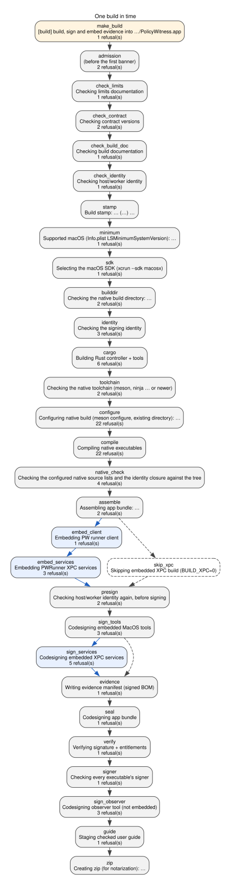

# The build

This document is the account of one build in time: what each step reads,
writes and refuses; the two knobs and what each governs; what `meson.build`
owns and what `build.sh` owns; the trust placed in the build directories; the
signing contract; the evidence the build embeds; and how the build verifies
itself. It does not ship. The [user guide](PolicyWitness.md) keeps its one
sentence on the supported macOS,
[CONTRACT.md](CONTRACT.md#internal-hostworker-identity) keeps the identity's
definition, and [SIGNING.md](SIGNING.md) keeps evidence, notarization,
release and the archives.

The figure and the tables are generated from [build.json](build.json) by
[generate_build.py](generate_build.py), which parses the script and refuses
a manifest that disagrees with it. Every row cites the source symbol that
implements it and the test or rule that covers it; a citation is a place to
look, not proof that a test asserts the row. The build has
<!-- span build.steps -->30<!-- /span --> steps,
<!-- span build.refusals -->65<!-- /span --> refusals, of which
<!-- span build.uncovered -->28<!-- /span --> have no control that produces
them, <!-- span build.signing -->8<!-- /span --> signing calls and
<!-- span build.knobs -->2<!-- /span --> knobs.

## Why the build is shaped this way

Three ideas shape the script. The app is a coherent signed specimen: one
bundle, assembled from compilers the script drives itself, signed from the
inside out with one explicitly named identity, and carrying a manifest of the
bytes that were signed. The host and the worker share an exact source identity
([`generate_worker_identity.py`](generate_worker_identity.py)), checked before
compiling and again before signing, so the pair that ships carries the
identity of the sources in the tree; that the binaries were compiled from
those sources rests on the build directories' own records, as the last section
says. And every refusal precedes the step it protects: the documentation and
identity checks run before any compile, each compile is followed by its own
checks before anything is copied, every copy precedes every signature, and the
signatures precede the ZIP. A refusal before assembly leaves the previous
distribution outputs untouched, though the build directories change as the
compiles run; a refusal between assembly and the seal leaves an unsealed
partial app and no ZIP; a refusal after the seal leaves a sealed app that
failed verification, the signer check, the observer's signature or packaging,
and no ZIP or a partial one. The test inspector refuses that last residue,
because it requires every executable to carry the controller's signer.

Two consequences follow. The build writes no tracked file: a stale generated
copy is refused with the command that regenerates it, never repaired in place,
so a clean checkout builds with a clean stamp; its writes go to the two build
directories, to the standalone observer's signature inside Cargo's, and to the
output directory, all inside the checkout and ignored by git. And the build is
a function of the checkout, its two build directories and the inputs the next
section lists; it trusts the directories as it trusts the checkout, and it
refuses a Meson build directory that belongs to another checkout.

`make build` is the documented entry and the first row of the step table. It
is the caller, not the unit: the release targets reach the same row through
`$(MAKE) build`, and a direct `./build.sh` skips the Makefile's guard and
meets the script's own.

## Inputs beyond the tree

The build reads these outside the checkout, in the order it meets them.

- **The git stamp.** `git describe`, `rev-parse` and `rev-list` give the
  version, the commit count, the describe string and the commit
  ([`PW_BUILD_DESCRIBE`](../build.sh)). `PW_VERSION` and `PW_BUILD_NUMBER`
  override the first two for builds outside a checkout; the other two always
  come from git or read `unknown`. The same four values reach the controller
  through Cargo ([build.rs](../controller/build.rs)) and both plists
  ([`stamp_info_plist`](../build.sh)).
- **The supported macOS.** [`LSMinimumSystemVersion`](../Info.plist) is the
  one declaration the script enforces: it becomes `MACOSX_DEPLOYMENT_TARGET`
  for Cargo, and every Cargo and Meson executable is checked against it
  before assembly ([`check_minimum_macos`](../build.sh)). `meson.build` pins
  the same value for the native compile and link
  ([`macos_minimum`](../meson.build)); the two agree because a build in which
  they disagree refuses.
- **The SDK and the developer directory.** `xcrun --sdk macosx` selects the
  SDK once, under whatever `DEVELOPER_DIR` names, and the script exports it
  as `SDKROOT` for Cargo and Meson alike; a failed selection refuses before
  the build directory and the signing identity are checked. Which toolchain
  `xcrun` resolves is the operator's choice and is not fingerprinted.
- **The two build directories.** Meson's is checked: a directory whose
  recorded source is another checkout, or whose record cannot be read, is
  refused before Cargo. Cargo's is pinned with `--target-dir`, and Cargo is
  asked to report the executables it produced, so one placed under another
  directory by a target triple or a Cargo setting is refused before any copy.
- **The signing identity.** `IDENTITY` must name a Developer ID Application
  identity that `security find-identity` lists; nothing is selected
  automatically, and any other class is refused before Cargo. Whether the
  keychain is unlocked is not checked until the first signature.
- **Cargo's environment.** `cargo` is resolved on `PATH` and brings its own
  configuration, caches and registries. The script adds the four stamp
  variables, `MACOSX_DEPLOYMENT_TARGET`, `SDKROOT`, and `RUSTFLAGS` with
  debug info, frame pointers and opt-level 1 when inspection is on and the
  caller left it unset or empty; a caller's `RUSTFLAGS` wins silently. A
  plain `cargo build` outside the script carries none of this; on the
  toolchain this was observed with, it produced executables for an older
  macOS than the plist declares, which the minimum check would refuse.
- **The output directory.** `DIST_DIR`, `dist/` by default; a custom one
  also receives copies of the tracked `dist/` README and AGENTS files. Its
  trust and that of the build directories are in the table.

<!-- BEGIN GENERATED BUILD DIRECTORIES -->
| Directory | Trusted as | Refused when | Sources | Checks |
| --- | --- | --- | --- | --- |
| builddir/ | Meson's configuration and incremental native outputs for this checkout | its recorded source directory is not this checkout, or its meson-info cannot be read | [`MESON_SOURCE_DIR`](../build.sh) | [`check_refusals`](../tests/suites/source_drift/build_rules.py); [`test_build_refuses_a_build_directory_configured_for_another_checkout_before_cargo`](../tests/suites/source_drift/contract.py) |
| controller/target/ | Cargo's incremental outputs under the pinned --target-dir | Cargo reports an executable at another path than the pinned one; otherwise a stale output is caught only by the minimum-version check and Cargo's own fingerprints | [`CARGO_TARGET_DIR_PINNED`](../build.sh) | [`check_invocations`](../tests/suites/source_drift/build_rules.py) |
| dist/ (DIST_DIR) | the output directory; the previous app, ZIP and guide are removed one after another at assembly and nothing is preserved | never; a failure between those removals leaves a mixture, a refusal before the seal leaves an unsealed partial app, and a refusal after it leaves a sealed app the test inspector refuses | [`rm -f "${ZIP_NAME}" "${GUIDE_NAME}"`](../build.sh) | [`check_banner_order`](../tests/suites/source_drift/build_rules.py) |
<!-- END GENERATED BUILD DIRECTORIES -->

Some prerequisites are the operator's and are not checked. Meson and Ninja
must be installed; their presence and Ninja's version are checked, the
toolchain they drive is not. A compiler or SDK change needs a fresh build
directory, because nothing fingerprints the toolchain. Signing needs an
unsandboxed shell with the login keychain and network access for the
timestamp service. A release needs a clean checkout at the release commit,
which the release preflight checks and an ordinary build does not.
[SIGNING.md](SIGNING.md#sandboxed-automation-harnesses) says which refusals
a sandboxed harness produces.

## One build in time

<!-- BEGIN GENERATED BUILD FIGURE -->

*Figure: one build in time, step by step. Generated from [build.json](build.json) by [generate_build.py](generate_build.py); dot source in [build-steps.dot](build-steps.dot). The ids in the figure are the ids in the step table; a blue node and a blue edge belong only to a full build, a dashed node or edge only to a partial build, and the two paths rejoin where both variants run. Symbol presence and test definition are verified, and the banner order, the refusal messages with the script's own statuses and steps, knob values, signing calls with their flags, helper and tool invocations with their listed flags, and the signing inventory are compared with the script by the build_documentation case; whether a test asserts the row, or a refusal fires before the operation it protects, is not verified.*
<!-- END GENERATED BUILD FIGURE -->

<!-- BEGIN GENERATED BUILD STEPS -->

30 steps in order, with symbol presence and test definition verified and the banner order compared with the script; whether a test asserts the row is not verified

| Id | Banner | Variants | Reads | Writes | Refusals | Sources | Checks |
| --- | --- | --- | --- | --- | --- | --- | --- |
| make_build | Makefile: [build] build, sign and embed evidence into $(DIST_DIR)/PolicyWitness.app | both | IDENTITY and DIST_DIR from the make command line | nothing; runs build.sh with them | make_identity_unset | [`[build] build, sign and embed evidence into $(DIST_DIR)/PolicyWitness.app`](../Makefile) | [`check_makefile_entry`](../tests/suites/source_drift/build_rules.py); [`test_make_build_refuses_without_an_identity_and_never_runs_the_script`](../tests/suites/source_drift/contract.py) |
| admission | (none) | both | BUILD_XPC, PW_INSPECTION and the argument list; --help prints the usage and exits before any check, after the knobs are validated | nothing | knob_value, unknown_argument | [`must be 0 or 1`](../build.sh) | [`check_refusals`](../tests/suites/source_drift/build_rules.py); [`test_build_refuses_a_knob_value_other_than_0_or_1_before_any_check`](../tests/suites/source_drift/contract.py); [`test_build_refuses_an_unknown_argument_before_any_check`](../tests/suites/source_drift/contract.py) |
| check_limits | Checking limits documentation | both | docs/limits.json and the documents it renders | nothing | stale_limits | [`Checking limits documentation`](../build.sh) | [`check_banner_order`](../tests/suites/source_drift/build_rules.py) |
| check_contract | Checking contract versions | both | docs/contract.json, docs/architecture.json and their generated copies | nothing | stale_contract, stale_architecture | [`Checking contract versions`](../build.sh) | [`check_banner_order`](../tests/suites/source_drift/build_rules.py) |
| check_build_doc | Checking build documentation | both | docs/build.json, build.sh, meson.build, the Makefile, the inventories, the baseline and the generated copies | nothing | stale_build_doc | [`Checking build documentation`](../build.sh) | [`check_banner_order`](../tests/suites/source_drift/build_rules.py) |
| check_identity | Checking host/worker identity | both | the identity inputs and the three generated copies | nothing | stale_identity | [`Checking host/worker identity`](../build.sh) | [`check_banner_order`](../tests/suites/source_drift/build_rules.py) |
| stamp | Build stamp: ${PW_VERSION} (${PW_BUILD_NUMBER}) ${PW_BUILD_DESCRIBE} | both | git describe, rev-parse and rev-list, or PW_VERSION and PW_BUILD_NUMBER from the environment | the four stamp variables for Cargo and the plists | none | [`Build stamp: ${PW_VERSION} (${PW_BUILD_NUMBER}) ${PW_BUILD_DESCRIBE}`](../build.sh) | [`check_banner_order`](../tests/suites/source_drift/build_rules.py) |
| minimum | Supported macOS (Info.plist LSMinimumSystemVersion): ${PW_MINIMUM_MACOS} | both | LSMinimumSystemVersion in Info.plist | MACOSX_DEPLOYMENT_TARGET for Cargo | plist_minimum_malformed | [`Supported macOS (Info.plist LSMinimumSystemVersion): ${PW_MINIMUM_MACOS}`](../build.sh) | [`check_banner_order`](../tests/suites/source_drift/build_rules.py) |
| sdk | Selecting the macOS SDK (xcrun --sdk macosx) | both | the SDK path xcrun reports under DEVELOPER_DIR | SDKROOT for Cargo and Meson | sdk_unavailable | [`Selecting the macOS SDK (xcrun --sdk macosx)`](../build.sh) | [`check_banner_order`](../tests/suites/source_drift/build_rules.py) |
| builddir | Checking the native build directory: ${MESON_BUILD_DIR} | both | builddir/meson-info/meson-info.json when the directory is configured | nothing | builddir_unreadable, builddir_other_checkout | [`Checking the native build directory: ${MESON_BUILD_DIR}`](../build.sh) | [`check_banner_order`](../tests/suites/source_drift/build_rules.py) |
| identity | Checking the signing identity | both | IDENTITY and the keychain listing; the two knobs, for Meson's options and RUSTFLAGS | RUSTFLAGS, when inspection is on and it was unset or empty | identity_unset, identity_class, identity_absent | [`Checking the signing identity`](../build.sh) | [`check_banner_order`](../tests/suites/source_drift/build_rules.py) |
| cargo | Building Rust controller + tools | both | cargo on PATH with its configuration, caches and registries; controller/ sources, the stamp variables, MACOSX_DEPLOYMENT_TARGET, SDKROOT and RUSTFLAGS; the artifact paths Cargo reports | controller/target/release/ under the pinned output directory, and the messages file Cargo reports its artifacts in | missing_controller, missing_observer, missing_sbpl_check, cargo_artifact_elsewhere, minimum_mismatch, cargo_failed | [`Building Rust controller + tools`](../build.sh) | [`check_banner_order`](../tests/suites/source_drift/build_rules.py) |
| toolchain | Checking the native toolchain (meson, ninja ${NINJA_MINIMUM} or newer) | both | meson and ninja on PATH and ninja's version | nothing | meson_ninja_missing, ninja_old | [`Checking the native toolchain (meson, ninja ${NINJA_MINIMUM} or newer)`](../build.sh) | [`check_banner_order`](../tests/suites/source_drift/build_rules.py) |
| configure | Configuring native build (meson configure, existing directory): ${MESON_OPTIONS[*]} / Configuring native build (meson setup, fresh directory): ${MESON_BUILD_DIR} ${MESON_OPTIONS[*]} | both | whether builddir/build.ninja exists, meson.build, meson.options and the two knobs as Meson options; a fresh setup also reads CFLAGS and the other flag variables | builddir/ configuration; meson configure records the two options and the policy assertions run at setup or at the regeneration the next compile triggers | meson_optimization, meson_debug, meson_warning_level, meson_werror, meson_strip, meson_unity, meson_b_ndebug, meson_b_lto, meson_b_coverage, meson_b_pgo, meson_b_bitcode, meson_b_pie, meson_b_staticpic, meson_b_lundef, meson_b_sanitize, meson_c_std, meson_c_args, meson_c_link_args, meson_buildtype, meson_swift_args, meson_swift_link_args, meson_failed | [`Configuring native build (meson configure, existing directory): ${MESON_OPTIONS[*]}`](../build.sh) | [`check_banner_order`](../tests/suites/source_drift/build_rules.py) |
| compile | Compiling native executables | both | the native sources through builddir/; a changed option triggers regeneration, which runs the policy assertions first | builddir/ outputs and the Swift module cache under it | meson_optimization, meson_debug, meson_warning_level, meson_werror, meson_strip, meson_unity, meson_b_ndebug, meson_b_lto, meson_b_coverage, meson_b_pgo, meson_b_bitcode, meson_b_pie, meson_b_staticpic, meson_b_lundef, meson_b_sanitize, meson_c_std, meson_c_args, meson_c_link_args, meson_buildtype, meson_swift_args, meson_swift_link_args, meson_failed | [`Compiling native executables`](../build.sh) | [`check_banner_order`](../tests/suites/source_drift/build_rules.py) |
| native_check | Checking the configured native source lists and the identity closure against the tree | both | Meson's introspection of builddir/, Ninja's dependency log, the identity inputs and the Meson outputs' load commands | nothing | minimum_mismatch, missing_native_output, native_sources_differ, native_sources_unreadable | [`Checking the configured native source lists and the identity closure against the tree`](../build.sh) | [`check_banner_order`](../tests/suites/source_drift/build_rules.py) |
| assemble | Assembling app bundle: ${APP_BUNDLE} | both | Info.plist, the three Rust outputs, runner/augments/, dist/README.md and dist/AGENTS.md | the two documents under DIST_DIR; removes the previous app, ZIP and guide; the stamped Info.plist, the three Rust executables and the augments under the new app | missing_info_plist, missing_augments_dir | [`Assembling app bundle: ${APP_BUNDLE}`](../build.sh) | [`check_banner_order`](../tests/suites/source_drift/build_rules.py) |
| embed_client | Embedding PW runner client | full | builddir/pw-runner-client | Contents/MacOS/pw-runner-client and its dSYM in inspection builds | missing_client_output | [`Embedding PW runner client`](../build.sh) | [`check_banner_order`](../tests/suites/source_drift/build_rules.py) |
| embed_services | Embedding PWRunner XPC services | full | each service's Info.plist and builddir/ host, the worker and the validator | each service bundle: its stamped Info.plist, the host with its dSYM in inspection builds, the worker and the validator | missing_service_dir, missing_service_plist, missing_host_output | [`Embedding PWRunner XPC services`](../build.sh) | [`check_banner_order`](../tests/suites/source_drift/build_rules.py) |
| skip_xpc | Skipping embedded XPC build (BUILD_XPC=0) | partial | nothing | nothing | none | [`Skipping embedded XPC build (BUILD_XPC=0)`](../build.sh) | [`check_banner_order`](../tests/suites/source_drift/build_rules.py) |
| presign | Checking host/worker identity again, before signing | both | the identity inputs and copies, and whether PolicyWitness.entitlements exists | nothing | missing_entitlements, stale_identity_presign | [`Checking host/worker identity again, before signing`](../build.sh) | [`check_banner_order`](../tests/suites/source_drift/build_rules.py) |
| sign_tools | Codesigning embedded MacOS tools | both | the copied top-level helpers | signatures on the top-level helpers | sign_target_missing, sign_target_not_macho, codesign_failed | [`Codesigning embedded MacOS tools`](../build.sh) | [`check_banner_order`](../tests/suites/source_drift/build_rules.py) |
| sign_services | Codesigning embedded XPC services | full | each service's Entitlements.plist and bundle | signatures on the nested helpers, then each service seal | sign_target_missing, sign_target_not_macho, missing_service_bundle, missing_service_entitlements, codesign_failed | [`Codesigning embedded XPC services`](../build.sh) | [`check_banner_order`](../tests/suites/source_drift/build_rules.py) |
| evidence | Writing evidence manifest (signed BOM) | both | the signed bytes, entitlements and exported symbols of the helpers, services and augments | Contents/Resources/Evidence/manifest.json and symbols.json | evidence_failed | [`Writing evidence manifest (signed BOM)`](../build.sh) | [`check_banner_order`](../tests/suites/source_drift/build_rules.py) |
| seal | Codesigning app bundle | both | PolicyWitness.entitlements | the app seal over everything under Contents/ | codesign_failed | [`Codesigning app bundle`](../build.sh) | [`check_banner_order`](../tests/suites/source_drift/build_rules.py) |
| verify | Verifying signature + entitlements | both | the sealed app | nothing | verify_failed | [`Verifying signature + entitlements`](../build.sh) | [`check_banner_order`](../tests/suites/source_drift/build_rules.py) |
| signer | Checking every executable's signer | both | every regular file under the app's and each service's Contents/MacOS | nothing | signer_mismatch | [`Checking every executable's signer`](../build.sh) | [`check_banner_order`](../tests/suites/source_drift/build_rules.py) |
| sign_observer | Codesigning observer tool (not embedded) | both | controller/target/release/sandbox-log-observer | that executable's signature, in place | sign_target_missing, sign_target_not_macho, codesign_failed | [`Codesigning observer tool (not embedded)`](../build.sh) | [`check_banner_order`](../tests/suites/source_drift/build_rules.py) |
| guide | Staging checked user guide | both | docs/PolicyWitness.md and its inputs | PolicyWitness.md under DIST_DIR | stale_guide | [`Staging checked user guide`](../build.sh) | [`check_banner_order`](../tests/suites/source_drift/build_rules.py) |
| zip | Creating zip (for notarization): ${ZIP_NAME} | both | the sealed app | PolicyWitness.zip under DIST_DIR | none | [`Creating zip (for notarization): ${ZIP_NAME}`](../build.sh) | [`check_banner_order`](../tests/suites/source_drift/build_rules.py) |

<!-- END GENERATED BUILD STEPS -->

How to read the table. A step is a banner the script prints; the rows are in
script order, and the generator refuses a manifest whose banners are not the
script's, in that order, under the same `BUILD_XPC` branches
([`check_banner_order`](../tests/suites/source_drift/build_rules.py)). The
first row is the Makefile's `build` target; the second, `admission`, has no
banner and holds the refusals that fire before any banner prints. A refusal
belongs to the banner that precedes it in the script, and a refusal inside a
function belongs to every step that calls the function; the script is arranged
so that every refusal follows the banner of the step it protects, which is
what makes that rule honest. Variants are `full` (`BUILD_XPC=1`) and `partial`
(`BUILD_XPC=0`); a row marked `both` runs in either. `--help` prints the usage
and exits before any check, once the knobs are validated. The script prints
one warning that is not a refusal, when the augments directory holds no
augment; warnings are not in the tables. Reads and Writes are the manifest's
description of each step, and nothing compares them to the script.

What the order establishes. The documentation and identity checks precede
every compile, each compile's own checks follow it and precede any copy, the
copies precede every signature, and the signatures precede the ZIP, as the
table shows and the rule compares. That is textual order. Whether a refusal
fires and stops the next operation is established only where a control drives
the build and observes it; the refusals table says which rows have one.

The partial build. With `BUILD_XPC=0` the script still runs Cargo, builds and
minimum-checks the two C executables, checks the signing identity, and signs
and packages a bundle without the client, the service or the embedded helpers;
the `skip_xpc` row stands in for the embed and service-signing rows it skips.
That bundle passes evidence generation and the seal, fails the full inspector,
and cannot run a specimen, because its evidence manifest names no runner. It
is an iteration convenience, never a release or test artifact, though the
script still writes its ZIP under the release name.

Packaging. After the signer check and the standalone observer, the script
stages the checked user guide beside the app and writes the ZIP for
notarization; the staging command checks the guide's sources again before it
writes; the staged copy itself is compared by a test, not by the build.

## Refusals

<!-- BEGIN GENERATED BUILD REFUSALS -->

65 refusals (28 the script's own, 21 Meson assertions, 15 propagated from a check or a tool, 1 in the Makefile), with symbol presence and test definition verified and the messages, statuses and steps compared with the script; 28 have no control that produces them and are listed in the baseline; whether a test asserts the row is not verified

| Id | Message | Steps | Status | Kind | Variants | Coverage | Sources | Checks |
| --- | --- | --- | --- | --- | --- | --- | --- | --- |
| knob_value | ${knob} must be 0 or 1 (got '${!knob}') | admission | 2 | script | both | a control produces it | [`${knob} must be 0 or 1 (got '${!knob}')`](../build.sh) | [`check_refusals`](../tests/suites/source_drift/build_rules.py); [`test_build_refuses_a_knob_value_other_than_0_or_1_before_any_check`](../tests/suites/source_drift/contract.py) |
| unknown_argument | unknown argument: $1 | admission | 2 | script | both | a control produces it | [`unknown argument: $1`](../build.sh) | [`check_refusals`](../tests/suites/source_drift/build_rules.py); [`test_build_refuses_an_unknown_argument_before_any_check`](../tests/suites/source_drift/contract.py) |
| plist_minimum_malformed | Info.plist LSMinimumSystemVersion is not a major.minor version: '${PW_MINIMUM_MACOS}' | minimum | 2 | script | both | a control produces it | [`Info.plist LSMinimumSystemVersion is not a major.minor version: '${PW_MINIMUM_MACOS}'`](../build.sh) | [`check_refusals`](../tests/suites/source_drift/build_rules.py); [`test_build_refuses_a_malformed_plist_minimum_after_its_banner_and_before_the_sdk`](../tests/suites/source_drift/contract.py) |
| sdk_unavailable | xcrun could not select the macOS SDK (DEVELOPER_DIR=${DEVELOPER_DIR:-unset}) | sdk | 2 | script | both | none; listed in the baseline | [`xcrun could not select the macOS SDK (DEVELOPER_DIR=${DEVELOPER_DIR:-unset})`](../build.sh) | [`check_refusals`](../tests/suites/source_drift/build_rules.py) |
| builddir_unreadable | ${MESON_BUILD_DIR} has no readable meson-info; remove it or use a fresh build directory | builddir | 2 | script | both | a control produces it | [`${MESON_BUILD_DIR} has no readable meson-info; remove it or use a fresh build directory`](../build.sh) | [`check_refusals`](../tests/suites/source_drift/build_rules.py); [`test_build_refuses_a_build_directory_configured_for_another_checkout_before_cargo`](../tests/suites/source_drift/contract.py) |
| builddir_other_checkout | ${MESON_BUILD_DIR} is configured for ${MESON_SOURCE_DIR}, not this checkout (${ROOT_DIR}); remove it or use a fresh build directory | builddir | 2 | script | both | a control produces it | [`${MESON_BUILD_DIR} is configured for ${MESON_SOURCE_DIR}, not this checkout (${ROOT_DIR}); remove it or use a fresh build directory`](../build.sh) | [`check_refusals`](../tests/suites/source_drift/build_rules.py); [`test_build_refuses_a_build_directory_configured_for_another_checkout_before_cargo`](../tests/suites/source_drift/contract.py) |
| identity_unset | IDENTITY is not set. | identity | 2 | script | both | a control produces it | [`IDENTITY is not set.`](../build.sh) | [`check_refusals`](../tests/suites/source_drift/build_rules.py); [`test_build_refuses_a_build_directory_configured_for_another_checkout_before_cargo`](../tests/suites/source_drift/contract.py) |
| identity_class | IDENTITY must name a Developer ID Application identity; got: | identity | 2 | script | both | a control produces it | [`IDENTITY must name a Developer ID Application identity; got:`](../build.sh) | [`check_refusals`](../tests/suites/source_drift/build_rules.py); [`test_build_refuses_a_non_developer_id_identity_before_cargo`](../tests/suites/source_drift/contract.py) |
| identity_absent | codesigning identity not found in your keychain: | identity | 2 | script | both | a control produces it | [`codesigning identity not found in your keychain:`](../build.sh) | [`check_refusals`](../tests/suites/source_drift/build_rules.py); [`test_build_refuses_a_developer_id_identity_the_keychain_lacks_before_cargo`](../tests/suites/source_drift/contract.py) |
| missing_controller | expected policy-witness binary at ${RUNNER_BIN} | cargo | 2 | script | both | none; listed in the baseline | [`expected policy-witness binary at ${RUNNER_BIN}`](../build.sh) | [`check_refusals`](../tests/suites/source_drift/build_rules.py) |
| missing_observer | expected sandbox-log-observer binary at ${SANDBOX_LOG_OBSERVER_BIN} | cargo | 2 | script | both | none; listed in the baseline | [`expected sandbox-log-observer binary at ${SANDBOX_LOG_OBSERVER_BIN}`](../build.sh) | [`check_refusals`](../tests/suites/source_drift/build_rules.py) |
| missing_sbpl_check | expected sbpl-check binary at ${SBPL_CHECK_BIN} | cargo | 2 | script | both | none; listed in the baseline | [`expected sbpl-check binary at ${SBPL_CHECK_BIN}`](../build.sh) | [`check_refusals`](../tests/suites/source_drift/build_rules.py) |
| cargo_artifact_elsewhere | cargo built ${bin_name} at ${bin_path}, not at ${bin_expected}; a target triple or a Cargo setting moved it | cargo | 2 | script | both | none; listed in the baseline | [`cargo built ${bin_name} at ${bin_path}, not at ${bin_expected}; a target triple or a Cargo setting moved it`](../build.sh) | [`check_refusals`](../tests/suites/source_drift/build_rules.py) |
| minimum_mismatch | ${target} is built for macOS ${minos:-?}; Info.plist declares ${PW_MINIMUM_MACOS} | cargo, native_check | 2 | script | both | none; listed in the baseline | [`${target} is built for macOS ${minos:-?}; Info.plist declares ${PW_MINIMUM_MACOS}`](../build.sh) | [`check_refusals`](../tests/suites/source_drift/build_rules.py) |
| meson_ninja_missing | meson and ninja are required for the native build (brew install meson ninja); see docs/SIGNING.md | toolchain | 2 | script | both | none; listed in the baseline | [`meson and ninja are required for the native build (brew install meson ninja); see docs/SIGNING.md`](../build.sh) | [`check_refusals`](../tests/suites/source_drift/build_rules.py) |
| ninja_old | ninja ${NINJA_VERSION} is older than the ${NINJA_MINIMUM} minimum; see docs/SIGNING.md | toolchain | 2 | script | both | none; listed in the baseline | [`ninja ${NINJA_VERSION} is older than the ${NINJA_MINIMUM} minimum; see docs/SIGNING.md`](../build.sh) | [`check_refusals`](../tests/suites/source_drift/build_rules.py) |
| missing_native_output | expected Meson output at ${native_bin} | native_check | 2 | script | both | none; listed in the baseline | [`expected Meson output at ${native_bin}`](../build.sh) | [`check_refusals`](../tests/suites/source_drift/build_rules.py) |
| missing_info_plist | missing ${INFO_PLIST_TEMPLATE} at repo root | assemble | 2 | script | both | none; listed in the baseline | [`missing ${INFO_PLIST_TEMPLATE} at repo root`](../build.sh) | [`check_refusals`](../tests/suites/source_drift/build_rules.py) |
| missing_augments_dir | missing augments source dir at ${XPC_AUGMENTS_DIR} | assemble | 2 | script | both | none; listed in the baseline | [`missing augments source dir at ${XPC_AUGMENTS_DIR}`](../build.sh) | [`check_refusals`](../tests/suites/source_drift/build_rules.py) |
| missing_client_output | expected Meson output at ${PW_RUNNER_CLIENT_BIN} | embed_client | 2 | script | full | none; listed in the baseline | [`expected Meson output at ${PW_RUNNER_CLIENT_BIN}`](../build.sh) | [`check_refusals`](../tests/suites/source_drift/build_rules.py) |
| missing_service_dir | missing ${svc_name} service dir at ${svc_dir} | embed_services | 2 | script | full | none; listed in the baseline | [`missing ${svc_name} service dir at ${svc_dir}`](../build.sh) | [`check_refusals`](../tests/suites/source_drift/build_rules.py) |
| missing_service_plist | ${svc_name} service is missing Info.plist | embed_services | 2 | script | full | none; listed in the baseline | [`${svc_name} service is missing Info.plist`](../build.sh) | [`check_refusals`](../tests/suites/source_drift/build_rules.py) |
| missing_host_output | expected Meson output at ${svc_host} | embed_services | 2 | script | full | none; listed in the baseline | [`expected Meson output at ${svc_host}`](../build.sh) | [`check_refusals`](../tests/suites/source_drift/build_rules.py) |
| missing_entitlements | missing entitlements plist: ${ENTITLEMENTS_PLIST} | presign | 2 | script | both | none; listed in the baseline | [`missing entitlements plist: ${ENTITLEMENTS_PLIST}`](../build.sh) | [`check_refusals`](../tests/suites/source_drift/build_rules.py) |
| sign_target_missing | expected a Mach-O to sign at ${target} | sign_tools, sign_services, sign_observer | 2 | script | both | none; listed in the baseline | [`expected a Mach-O to sign at ${target}`](../build.sh) | [`check_refusals`](../tests/suites/source_drift/build_rules.py) |
| sign_target_not_macho | ${target} is not a Mach-O; the signing list names only executables | sign_tools, sign_services, sign_observer | 2 | script | both | none; listed in the baseline | [`${target} is not a Mach-O; the signing list names only executables`](../build.sh) | [`check_refusals`](../tests/suites/source_drift/build_rules.py) |
| missing_service_bundle | expected XPC service bundle at ${svc_bundle} | sign_services | 2 | script | full | none; listed in the baseline | [`expected XPC service bundle at ${svc_bundle}`](../build.sh) | [`check_refusals`](../tests/suites/source_drift/build_rules.py) |
| missing_service_entitlements | ${svc_name} service is missing Entitlements.plist at ${svc_entitlements} | sign_services | 2 | script | full | none; listed in the baseline | [`${svc_name} service is missing Entitlements.plist at ${svc_entitlements}`](../build.sh) | [`check_refusals`](../tests/suites/source_drift/build_rules.py) |
| make_identity_unset | set IDENTITY to your Developer ID Application identity | make_build | 2 | make | both | a control produces it | [`set IDENTITY to your Developer ID Application identity`](../Makefile) | [`check_makefile_entry`](../tests/suites/source_drift/build_rules.py); [`test_make_build_refuses_without_an_identity_and_never_runs_the_script`](../tests/suites/source_drift/contract.py) |
| meson_optimization | fixed native policy: optimization must be 'plain' | configure, compile | 1 | meson | both | a control produces it in the helper, not through the script | [`'optimization'`](../meson.build) | [`check_meson_assertions`](../tests/suites/source_drift/build_rules.py); [`test_meson_policy_assertions_refuse_each_option`](../tests/suites/source_drift/build.py) |
| meson_debug | fixed native policy: debug must be false | configure, compile | 1 | meson | both | a control produces it in the helper, not through the script | [`'debug'`](../meson.build) | [`check_meson_assertions`](../tests/suites/source_drift/build_rules.py); [`test_meson_policy_assertions_refuse_each_option`](../tests/suites/source_drift/build.py) |
| meson_warning_level | fixed native policy: warning_level must be '0' | configure, compile | 1 | meson | both | a control produces it in the helper, not through the script | [`'warning_level'`](../meson.build) | [`check_meson_assertions`](../tests/suites/source_drift/build_rules.py); [`test_meson_policy_assertions_refuse_each_option`](../tests/suites/source_drift/build.py) |
| meson_werror | fixed native policy: werror must be false | configure, compile | 1 | meson | both | a control produces it in the helper, not through the script | [`'werror'`](../meson.build) | [`check_meson_assertions`](../tests/suites/source_drift/build_rules.py); [`test_meson_policy_assertions_refuse_each_option`](../tests/suites/source_drift/build.py) |
| meson_strip | fixed native policy: strip must be false | configure, compile | 1 | meson | both | a control produces it in the helper, not through the script | [`'strip'`](../meson.build) | [`check_meson_assertions`](../tests/suites/source_drift/build_rules.py); [`test_meson_policy_assertions_refuse_each_option`](../tests/suites/source_drift/build.py) |
| meson_unity | fixed native policy: unity must be 'off' | configure, compile | 1 | meson | both | a control produces it in the helper, not through the script | [`'unity'`](../meson.build) | [`check_meson_assertions`](../tests/suites/source_drift/build_rules.py); [`test_meson_policy_assertions_refuse_each_option`](../tests/suites/source_drift/build.py) |
| meson_b_ndebug | fixed native policy: b_ndebug must be 'false' | configure, compile | 1 | meson | both | a control produces it in the helper, not through the script | [`'b_ndebug'`](../meson.build) | [`check_meson_assertions`](../tests/suites/source_drift/build_rules.py); [`test_meson_policy_assertions_refuse_each_option`](../tests/suites/source_drift/build.py) |
| meson_b_lto | fixed native policy: b_lto must be false | configure, compile | 1 | meson | both | a control produces it in the helper, not through the script | [`'b_lto'`](../meson.build) | [`check_meson_assertions`](../tests/suites/source_drift/build_rules.py); [`test_meson_policy_assertions_refuse_each_option`](../tests/suites/source_drift/build.py) |
| meson_b_coverage | fixed native policy: b_coverage must be false | configure, compile | 1 | meson | both | a control produces it in the helper, not through the script | [`'b_coverage'`](../meson.build) | [`check_meson_assertions`](../tests/suites/source_drift/build_rules.py); [`test_meson_policy_assertions_refuse_each_option`](../tests/suites/source_drift/build.py) |
| meson_b_pgo | fixed native policy: b_pgo must be 'off' | configure, compile | 1 | meson | both | a control produces it in the helper, not through the script | [`'b_pgo'`](../meson.build) | [`check_meson_assertions`](../tests/suites/source_drift/build_rules.py); [`test_meson_policy_assertions_refuse_each_option`](../tests/suites/source_drift/build.py) |
| meson_b_bitcode | fixed native policy: b_bitcode must be false | configure, compile | 1 | meson | both | a control produces it in the helper, not through the script | [`'b_bitcode'`](../meson.build) | [`check_meson_assertions`](../tests/suites/source_drift/build_rules.py); [`test_meson_policy_assertions_refuse_each_option`](../tests/suites/source_drift/build.py) |
| meson_b_pie | fixed native policy: b_pie must be false | configure, compile | 1 | meson | both | a control produces it in the helper, not through the script | [`'b_pie'`](../meson.build) | [`check_meson_assertions`](../tests/suites/source_drift/build_rules.py); [`test_meson_policy_assertions_refuse_each_option`](../tests/suites/source_drift/build.py) |
| meson_b_staticpic | fixed native policy: b_staticpic must be true | configure, compile | 1 | meson | both | a control produces it in the helper, not through the script | [`'b_staticpic'`](../meson.build) | [`check_meson_assertions`](../tests/suites/source_drift/build_rules.py); [`test_meson_policy_assertions_refuse_each_option`](../tests/suites/source_drift/build.py) |
| meson_b_lundef | fixed native policy: b_lundef must be true | configure, compile | 1 | meson | both | a control produces it in the helper, not through the script | [`'b_lundef'`](../meson.build) | [`check_meson_assertions`](../tests/suites/source_drift/build_rules.py); [`test_meson_policy_assertions_refuse_each_option`](../tests/suites/source_drift/build.py) |
| meson_b_sanitize | fixed native policy: b_sanitize must be 'none' | configure, compile | 1 | meson | both | a control produces it in the helper, not through the script | [`'b_sanitize'`](../meson.build) | [`check_meson_assertions`](../tests/suites/source_drift/build_rules.py); [`test_meson_policy_assertions_refuse_each_option`](../tests/suites/source_drift/build.py) |
| meson_c_std | fixed native policy: c_std must be 'none' | configure, compile | 1 | meson | both | a control produces it in the helper, not through the script | [`'c_std'`](../meson.build) | [`check_meson_assertions`](../tests/suites/source_drift/build_rules.py); [`test_meson_policy_assertions_refuse_each_option`](../tests/suites/source_drift/build.py) |
| meson_c_args | fixed native policy: c_args must be [] | configure, compile | 1 | meson | both | a control produces it in the helper, not through the script | [`'c_args'`](../meson.build) | [`check_meson_assertions`](../tests/suites/source_drift/build_rules.py); [`test_meson_policy_assertions_refuse_each_option`](../tests/suites/source_drift/build.py) |
| meson_c_link_args | fixed native policy: c_link_args must be [] | configure, compile | 1 | meson | both | a control produces it in the helper, not through the script | [`'c_link_args'`](../meson.build) | [`check_meson_assertions`](../tests/suites/source_drift/build_rules.py); [`test_meson_policy_assertions_refuse_each_option`](../tests/suites/source_drift/build.py) |
| meson_buildtype | fixed native policy: buildtype must be 'plain' | configure, compile | 1 | meson | both | none; listed in the baseline | [`'buildtype'`](../meson.build) | [`check_meson_assertions`](../tests/suites/source_drift/build_rules.py) |
| meson_swift_args | fixed native policy: swift_args must be [] | configure, compile | 1 | meson | full | a control produces it in the helper, not through the script | [`'swift_args'`](../meson.build) | [`check_meson_assertions`](../tests/suites/source_drift/build_rules.py); [`test_meson_policy_assertions_refuse_each_option`](../tests/suites/source_drift/build.py) |
| meson_swift_link_args | fixed native policy: swift_link_args must be [] | configure, compile | 1 | meson | full | a control produces it in the helper, not through the script | [`'swift_link_args'`](../meson.build) | [`check_meson_assertions`](../tests/suites/source_drift/build_rules.py); [`test_meson_policy_assertions_refuse_each_option`](../tests/suites/source_drift/build.py) |
| stale_limits | stale <copy>; run python3 docs/generate_limits.py | check_limits | 1 | propagated | both | a control produces it | [`generate_limits.py`](../build.sh); [`stale`](../docs/generate_limits.py) | [`check_propagated_refusals`](../tests/suites/source_drift/build_rules.py); [`test_build_refuses_stale_guide_before_signing_or_creating_output`](../tests/suites/source_drift/limits.py) |
| stale_contract | stale <copy>; run python3 docs/generate_contract.py | check_contract | 1 | propagated | both | a control produces it | [`generate_contract.py`](../build.sh); [`stale`](../docs/generate_contract.py) | [`check_propagated_refusals`](../tests/suites/source_drift/build_rules.py); [`test_build_refuses_stale_contract_copy_before_signing_or_creating_output`](../tests/suites/source_drift/contract.py) |
| stale_architecture | architecture documentation is stale | check_contract | 1 | propagated | both | a control produces it | [`generate_architecture.py`](../build.sh); [`architecture documentation is stale`](../docs/generate_architecture.py) | [`check_propagated_refusals`](../tests/suites/source_drift/build_rules.py); [`test_build_checks_every_generator_before_signing`](../tests/suites/source_drift/generators.py); [`test_build_refuses_a_stale_architecture_copy_before_compiling`](../tests/suites/source_drift/contract.py) |
| stale_build_doc | build documentation is stale | check_build_doc | 1 | propagated | both | a control produces it | [`generate_build.py`](../build.sh); [`build documentation is stale`](../docs/generate_build.py) | [`check_propagated_refusals`](../tests/suites/source_drift/build_rules.py); [`test_build_checks_every_generator_before_signing`](../tests/suites/source_drift/generators.py); [`test_build_refuses_a_stale_build_document_copy_before_compiling`](../tests/suites/source_drift/contract.py) |
| stale_identity | stale <copy>; run python3 docs/generate_worker_identity.py | check_identity | 1 | propagated | both | a control produces it | [`generate_worker_identity.py`](../build.sh); [`stale`](../docs/generate_worker_identity.py) | [`check_propagated_refusals`](../tests/suites/source_drift/build_rules.py); [`test_build_refuses_a_stale_identity_copy_before_compiling_and_writes_nothing`](../tests/suites/source_drift/contract.py) |
| stale_identity_presign | stale <copy>; run python3 docs/generate_worker_identity.py | presign | 1 | propagated | both | none; listed in the baseline | [`generate_worker_identity.py`](../build.sh); [`stale`](../docs/generate_worker_identity.py) | [`check_propagated_refusals`](../tests/suites/source_drift/build_rules.py) |
| cargo_failed | Cargo's own diagnostic | cargo | 101 | propagated | both | none; listed in the baseline | [`cargo build`](../build.sh) | [`check_propagated_refusals`](../tests/suites/source_drift/build_rules.py) |
| meson_failed | Meson's or Ninja's own diagnostic | configure, compile | 1 | propagated | both | none; listed in the baseline | [`meson compile`](../build.sh); [`meson setup`](../build.sh) | [`check_propagated_refusals`](../tests/suites/source_drift/build_rules.py) |
| native_sources_differ | native source lists differ from the tree | native_check | 1 | propagated | both | a control produces it in the helper, not through the script | [`native_sources.py`](../build.sh); [`native source lists differ from the tree`](../tests/lib/native_sources.py) | [`check_propagated_refusals`](../tests/suites/source_drift/build_rules.py); [`configured_controls`](../tests/suites/source_drift/check_planner.py) |
| native_sources_unreadable | native sources: meson introspection failed | native_check | 2 | propagated | both | none; listed in the baseline | [`native_sources.py`](../build.sh); [`meson introspection failed`](../tests/lib/native_sources.py) | [`check_propagated_refusals`](../tests/suites/source_drift/build_rules.py) |
| codesign_failed | codesign's own diagnostic | sign_tools, sign_services, seal, sign_observer | 1 | propagated | both | none; listed in the baseline | [`codesign --force`](../build.sh) | [`check_propagated_refusals`](../tests/suites/source_drift/build_rules.py) |
| evidence_failed | missing app bundle Contents | evidence | 2 | propagated | both | none; listed in the baseline | [`build-evidence.py`](../build.sh); [`missing app bundle Contents`](../tests/build-evidence.py) | [`check_propagated_refusals`](../tests/suites/source_drift/build_rules.py) |
| verify_failed | codesign's own diagnostic | verify | 1 | propagated | both | none; listed in the baseline | [`codesign --verify`](../build.sh) | [`check_propagated_refusals`](../tests/suites/source_drift/build_rules.py) |
| signer_mismatch | executables not signed by <identity> with the hardened runtime | signer | 1 | propagated | both | a control produces it in the helper, not through the script | [`signer_check.py`](../build.sh); [`executables not signed by`](../tests/lib/signer_check.py) | [`check_propagated_refusals`](../tests/suites/source_drift/build_rules.py); [`signed_artifact_controls`](../tests/suites/preflight/run.sh) |
| stale_guide | stale PolicyWitness.md | guide | 1 | propagated | both | a control produces it in the helper, not through the script | [`--stage-guide`](../build.sh); [`stale`](../docs/generate_limits.py) | [`check_propagated_refusals`](../tests/suites/source_drift/build_rules.py); [`test_check_and_staging_refuse_stale_or_incomplete_documents_without_writing`](../tests/suites/source_drift/limits.py) |

<!-- END GENERATED BUILD REFUSALS -->

Statuses. The script's own refusals exit 2. A refusal that a check or a tool
produces propagates that tool's status: 1 for a stale generated copy or a
source list that differs from the tree, 2 when a check could not read what it
needed, Cargo's 101, and 1 from Meson, Ninja or codesign. Under `set -e` the
script exits with the failing command's status, so the status alone does not
say which step refused; the message does. The propagated statuses in the table
are the tools' documented ones, verified only where a control asserts them.
The table lists the refusals the script declares, Meson's assertions and the
checks and tools the script names; any other failing command also stops the
build with its own status, a plist key PlistBuddy cannot read, a copy or
removal that fails, `dsymutil`, `ditto`, and those stops have no row.

Coverage. Each row's coverage column says what produces the refusal in a test:
a control that drives the build and observes the message and the operation it
prevented; a control that drives the helper that prints it, which proves the
diagnostic but not its place in the script; or only the grounding rule that
compares the message with the script. The rows with nothing are listed in [the
baseline](../tests/fixtures/docs/build_baseline.json), each with the control
that would retire it, and
[release_preflight.py](../tests/lib/release_preflight.py) refuses a release
whose baseline grew or rewrote an entry since the previous release, as it does
for the prose baseline.

Known gap: <!-- span build.uncovered -->28<!-- /span --> of the
<!-- span build.refusals -->65<!-- /span --> refusals have no control that
produces them, so for those rows the table establishes that the message
exists in the script under that banner, not that the build stops there. The
baseline names them.

Known gap: the minimum checks after Cargo and after the native check, and the
signer check after verification, are placed before the operations they
protect in the text, and the invocation rule would name a move; no control
drives the build through a wrong minimum or an ad hoc helper to observe the
stop.

## What Meson owns and what the script owns

[meson.build](../meson.build) owns the native compile: the source lists of
the C worker and validator, the C shim and the two Swift executables, their
module names and flags, the supported macOS passed at compile and at link,
and the fixed policy. The policy is an enumerated list of options asserted
as effective values ([`fixed_options`](../meson.build)), with two more inside
the Swift branch; every option it names is refused at any other value, and
an option it does not name is not policed. The two public knobs are the only
configuration the script passes:

<!-- BEGIN GENERATED BUILD KNOBS -->
| Knob | Values | Unset means | Governs | Sources | Checks |
| --- | --- | --- | --- | --- | --- |
| BUILD_XPC | `1`: build and embed the Swift client, the XPC host and the C shim (Meson xpc=true); `0`: skip them; the two C executables still build and nothing Meson-built ships (Meson xpc=false) | 1 | Meson's xpc option, the embed and service-signing steps, and which Meson outputs are minimum-checked and signed | [`BUILD_XPC="${BUILD_XPC-1}"`](../build.sh); [`option('xpc'`](../meson.options) | [`check_knobs`](../tests/suites/source_drift/build_rules.py); [`test_build_refuses_a_knob_value_other_than_0_or_1_before_any_check`](../tests/suites/source_drift/contract.py) |
| PW_INSPECTION | `1`: Swift -Onone -g with a dSYM beside each Swift executable; RUSTFLAGS with debug info, frame pointers and opt-level 1 when RUSTFLAGS was unset or empty (Meson inspection=true); `0`: Swift -O and no dSYM; RUSTFLAGS untouched (Meson inspection=false) | 1 | Meson's inspection option, RUSTFLAGS and the dSYM step; the C executables are -O2 without debug info in both | [`PW_INSPECTION="${PW_INSPECTION-1}"`](../build.sh); [`option('inspection'`](../meson.options) | [`check_knobs`](../tests/suites/source_drift/build_rules.py); [`test_build_refuses_a_knob_value_other_than_0_or_1_before_any_check`](../tests/suites/source_drift/contract.py) |
<!-- END GENERATED BUILD KNOBS -->

The script maps the knobs onto Meson's `inspection` and `xpc` options on
every build: `meson setup` for a fresh directory and `meson configure`
afterwards, which records the two values and regenerates only when one
changed. A refused value is recorded too: `meson configure` with any other
option exits 0, and the assertion fires at the next regeneration, which the
compile step triggers before anything compiles, or at setup for a fresh
directory. Meson reads `CFLAGS` and the other flag variables only at setup,
so a fresh directory refuses them the same way. Executables are linked with
`b_asneeded=false` declared per target; Meson's own additions to the compile
and link lines are accepted, and recorded by the comparison tools rather than
by the build.

The script owns everything around the compile: the plist's declaration and the
per-output minimum check, the build-directory guard, the configured source and
closure check, Cargo's environment, the dSYM step, assembly, signing, evidence
and packaging. Two of its checks look inside the build directory. Before
Cargo, it refuses a directory whose recorded source directory is not this
checkout ([`MESON_SOURCE_DIR`](../build.sh)), because Meson keeps compiling
the directory it was set up for and every later check would pass against that
other tree. After compiling,
[`native_sources.py`](../tests/lib/native_sources.py) reads the targets Meson
actually evaluated and refuses unless every target's sources are exactly the
files the tree holds for it, reads Ninja's dependency log and refuses, for the
worker and the shim, an include of a repository file outside the identity's
inputs or of a file outside the checkout that is not under the selected SDK or
the developer directory, and repeats the checkout comparison. Both are
membership checks: what the compiler did with those files is not established.

## The signing contract

Identity. `IDENTITY` must name a Developer ID Application identity that the
keychain lists, and the script signs with that identity or not at all. The
tests resolve their own identity separately.

Gates before any signature. The generated identity copies must be current,
checked again after assembly so an identity input edited during the build
without regeneration is refused before signing; the build otherwise trusts the
checkout not to change under it. Every Cargo and Meson executable carried the
plist's minimum, and the configured source lists and closure matched the tree,
before assembly began.

<!-- BEGIN GENERATED BUILD SIGNING -->

8 signing calls in order, with symbol presence and test definition verified and the calls, their targets and entitlements compared with the script and the signed inventory with EXECUTABLES, the evidence generator and the README; whether a test asserts the row is not verified

| # | Target | Kind | Flags | Entitlements | In the service loop | Step | Variants | Sources | Checks |
| --- | --- | --- | --- | --- | --- | --- | --- | --- | --- |
| 1 | ${APP_BUNDLE}/Contents/MacOS/pw-runner-client | signature | --force --options runtime --timestamp | none | no | sign_tools | full | [`${APP_BUNDLE}/Contents/MacOS/pw-runner-client`](../build.sh) | [`check_signing`](../tests/suites/source_drift/build_rules.py); [`check_inventory`](../tests/suites/source_drift/build_rules.py) |
| 2 | ${APP_BUNDLE}/Contents/MacOS/sandbox-log-observer | signature | --force --options runtime --timestamp | none | no | sign_tools | both | [`${APP_BUNDLE}/Contents/MacOS/sandbox-log-observer`](../build.sh) | [`check_signing`](../tests/suites/source_drift/build_rules.py); [`check_inventory`](../tests/suites/source_drift/build_rules.py) |
| 3 | ${APP_BUNDLE}/Contents/MacOS/sbpl-check | signature | --force --options runtime --timestamp | none | no | sign_tools | both | [`${APP_BUNDLE}/Contents/MacOS/sbpl-check`](../build.sh) | [`check_signing`](../tests/suites/source_drift/build_rules.py); [`check_inventory`](../tests/suites/source_drift/build_rules.py) |
| 4 | ${svc_bundle}/Contents/MacOS/pw-probe-runner | signature | --force --options runtime --timestamp | none | XPC_SERVICE_NAMES | sign_services | full | [`${svc_bundle}/Contents/MacOS/pw-probe-runner`](../build.sh) | [`check_signing`](../tests/suites/source_drift/build_rules.py); [`check_inventory`](../tests/suites/source_drift/build_rules.py) |
| 5 | ${svc_bundle}/Contents/MacOS/sb_api_validator | signature | --force --options runtime --timestamp | none | XPC_SERVICE_NAMES | sign_services | full | [`${svc_bundle}/Contents/MacOS/sb_api_validator`](../build.sh) | [`check_signing`](../tests/suites/source_drift/build_rules.py); [`check_inventory`](../tests/suites/source_drift/build_rules.py) |
| 6 | ${svc_bundle} | seal | --force --options runtime --timestamp | ${svc_entitlements} | XPC_SERVICE_NAMES | sign_services | full | [`-s "${IDENTITY}" "${svc_bundle}"`](../build.sh) | [`check_signing`](../tests/suites/source_drift/build_rules.py); [`check_inventory`](../tests/suites/source_drift/build_rules.py) |
| 7 | ${APP_BUNDLE} | seal | --force --options runtime --timestamp | ${ENTITLEMENTS_PLIST} | no | seal | both | [`-s "${IDENTITY}" "${APP_BUNDLE}"`](../build.sh) | [`check_signing`](../tests/suites/source_drift/build_rules.py); [`check_inventory`](../tests/suites/source_drift/build_rules.py) |
| 8 | ${SANDBOX_LOG_OBSERVER_BIN} | signature | --force --options runtime --timestamp | none | no | sign_observer | both | [`sign_macho "${SANDBOX_LOG_OBSERVER_BIN}"`](../build.sh) | [`check_signing`](../tests/suites/source_drift/build_rules.py); [`check_inventory`](../tests/suites/source_drift/build_rules.py) |

<!-- END GENERATED BUILD SIGNING -->

Order. Signing is inside-out, in the table's order, every signature and seal
with `--force --options runtime --timestamp`, so the timestamp service must be
reachable; the evidence manifest is written between the service seal and the
app seal, so the app seal covers it. The dSYM bundles beside the Swift
executables are sealed as resources; their DWARF files are not signed. The
standalone observer under `controller/target/release` is signed in place, for
direct use; it is not part of the bundle.

The list and the inventory. [`sign_macho`](../build.sh) refuses a missing or
non-Mach-O target: the list names exactly the executables this build
produced. The grounding rule expands the list, through the service loop, into
bundle paths and requires them, plus the two bundle mains the seals sign, to
equal [`EXECUTABLES`](../tests/lib/artifact.py), the helper list in
[build-evidence.py](../tests/build-evidence.py) and the README's inventory
([`check_inventory`](../tests/suites/source_drift/build_rules.py)). Do not
add `--deep` to a signing step; it would sign whatever happens to be nested,
which is the opposite of a list.

After the seal. `codesign --verify --deep --strict` checks the seal, and then
[`signer_check.py`](../tests/lib/signer_check.py) requires every regular file
directly under the app's and each service's `Contents/MacOS`, whether or not
the list named it, to be a Mach-O signed by the named identity with the
hardened runtime. The linker leaves every compiler output ad hoc-signed, and
an ad hoc executable passes the seal, the deep verify and the inspector;
without this check only notarization would refuse it. The check reads the
leaf authority and the runtime flag, not the certificate's class or the
timestamp.

What is never production-signed. The manual validator helper,
`controller/tools/sb_api_validator/build.sh`, compiles the validator beside
its source and ad hoc-signs it with `debug.ent` for local debugging; its
output is ignored by git and never enters the bundle.

## The evidence the build embeds

After the nested signatures and before the app seal,
[build-evidence.py](../tests/build-evidence.py) writes
`Contents/Resources/Evidence/manifest.json` and `symbols.json`: the hash of
every helper and of each service's main executable as signed, with each one's
load-command UUID, entitlements and exported marker symbols as far as the
tools can read them (a tool's failure is recorded in the entry, not refused),
the hashes of the shipped augments, and the time of writing. The manifest is
then sealed by the app signature, so it describes signed bytes and is itself
signed. It omits the main executable's hash, which the seal records. The
controller reads it at run time to locate its runner, which is why a partial
bundle refuses to run a specimen.

The build writes no native build receipt. The tools that record one and
compare one native build with another are test equipment, described under
[comparing native builds](../tests/README.md#comparing-native-builds).

## How the build verifies itself

Before compiling, the script runs every generator's check: limits, contract,
architecture, this document, and the identity
([`check_banner_order`](../tests/suites/source_drift/build_rules.py) for the
order, [`build_checks`](../tests/suites/source_drift/generators.py) for the
set). Each writes nothing and exits 1 on a stale copy. This document's check
also parses the script and refuses a manifest that disagrees with it in what
the parser compares: the banner order, the refusal messages with their steps
and the script's own statuses, the knob values, the signing calls with their
flags, the helper and tool invocations with their listed flags, the signing
inventory, and the `set -euo pipefail` opening. A condition or an argument the
parser does not record is not compared.

The helpers and tools the build invokes, with the step each runs in:

<!-- BEGIN GENERATED BUILD INVOCATIONS -->

24 helper and tool invocations, with symbol presence and test definition verified and each command's name, step and listed flags compared with the script; whether a test asserts the row is not verified

| Id | Command | Flags compared | Step | Variants | Sources | Checks |
| --- | --- | --- | --- | --- | --- | --- |
| inv_limits_check | docs/generate_limits.py --check | (not compared) | check_limits | both | [`docs/generate_limits.py" --check`](../build.sh) | [`check_invocations`](../tests/suites/source_drift/build_rules.py) |
| inv_contract_check | docs/generate_contract.py --check | (not compared) | check_contract | both | [`docs/generate_contract.py" --check`](../build.sh) | [`check_invocations`](../tests/suites/source_drift/build_rules.py) |
| inv_architecture_check | docs/generate_architecture.py --check | (not compared) | check_contract | both | [`docs/generate_architecture.py" --check`](../build.sh) | [`check_invocations`](../tests/suites/source_drift/build_rules.py); [`test_build_checks_every_generator_before_signing`](../tests/suites/source_drift/generators.py) |
| inv_build_check | docs/generate_build.py --check | (not compared) | check_build_doc | both | [`docs/generate_build.py" --check`](../build.sh) | [`check_invocations`](../tests/suites/source_drift/build_rules.py); [`test_build_checks_every_generator_before_signing`](../tests/suites/source_drift/generators.py) |
| inv_identity_check | docs/generate_worker_identity.py --check | (not compared) | check_identity | both | [`docs/generate_worker_identity.py" --check`](../build.sh) | [`check_invocations`](../tests/suites/source_drift/build_rules.py) |
| inv_cargo | cargo build | --manifest-path --release --target-dir --message-format --bin --bin --bin | cargo | both | [`cargo build`](../build.sh) | [`check_invocations`](../tests/suites/source_drift/build_rules.py) |
| inv_cargo_artifacts | tests/lib/cargo_artifacts.py | (not compared) | cargo | both | [`cargo_artifacts.py`](../build.sh) | [`check_invocations`](../tests/suites/source_drift/build_rules.py) |
| inv_minimum_cargo | check_minimum_macos | (not compared) | cargo | both | [`check_minimum_macos "${rust_bin}"`](../build.sh) | [`check_invocations`](../tests/suites/source_drift/build_rules.py) |
| inv_meson_configure | meson configure | (not compared) | configure | both | [`meson configure`](../build.sh) | [`check_invocations`](../tests/suites/source_drift/build_rules.py) |
| inv_meson_setup | meson setup | (not compared) | configure | both | [`meson setup`](../build.sh) | [`check_invocations`](../tests/suites/source_drift/build_rules.py) |
| inv_meson_compile | meson compile | (not compared) | compile | both | [`meson compile`](../build.sh) | [`check_invocations`](../tests/suites/source_drift/build_rules.py) |
| inv_native_sources | tests/lib/native_sources.py --builddir | (not compared) | native_check | both | [`native_sources.py`](../build.sh) | [`check_invocations`](../tests/suites/source_drift/build_rules.py); [`configured_controls`](../tests/suites/source_drift/check_planner.py) |
| inv_minimum_native | check_minimum_macos | (not compared) | native_check | both | [`check_minimum_macos "${native_bin}"`](../build.sh) | [`check_invocations`](../tests/suites/source_drift/build_rules.py) |
| inv_stamp_app | stamp_info_plist | (not compared) | assemble | both | [`stamp_info_plist "${APP_BUNDLE}/Contents/Info.plist"`](../build.sh) | [`check_invocations`](../tests/suites/source_drift/build_rules.py) |
| inv_dsym_client | embed_dsym | (not compared) | embed_client | full | [`embed_dsym "${APP_BUNDLE}/Contents/MacOS/pw-runner-client"`](../build.sh) | [`check_invocations`](../tests/suites/source_drift/build_rules.py) |
| inv_stamp_service | stamp_info_plist | (not compared) | embed_services | full | [`stamp_info_plist "${svc_bundle}/Contents/Info.plist"`](../build.sh) | [`check_invocations`](../tests/suites/source_drift/build_rules.py) |
| inv_dsym_host | embed_dsym | (not compared) | embed_services | full | [`embed_dsym "${svc_bundle}/Contents/MacOS/${svc_name}"`](../build.sh) | [`check_invocations`](../tests/suites/source_drift/build_rules.py) |
| inv_identity_presign | docs/generate_worker_identity.py --check | (not compared) | presign | both | [`docs/generate_worker_identity.py" --check`](../build.sh) | [`check_invocations`](../tests/suites/source_drift/build_rules.py) |
| inv_evidence | tests/build-evidence.py --app-bundle | (not compared) | evidence | both | [`build-evidence.py`](../build.sh) | [`check_invocations`](../tests/suites/source_drift/build_rules.py); [`signed_artifact_controls`](../tests/suites/preflight/run.sh) |
| inv_verify | codesign --verify | (not compared) | verify | both | [`codesign --verify --deep --strict`](../build.sh) | [`check_invocations`](../tests/suites/source_drift/build_rules.py) |
| inv_display | codesign --display | (not compared) | verify | both | [`codesign --display --entitlements`](../build.sh) | [`check_invocations`](../tests/suites/source_drift/build_rules.py) |
| inv_signer | tests/lib/signer_check.py | (not compared) | signer | both | [`signer_check.py`](../build.sh) | [`check_invocations`](../tests/suites/source_drift/build_rules.py); [`signed_artifact_controls`](../tests/suites/preflight/run.sh) |
| inv_guide | docs/generate_limits.py --stage-guide | (not compared) | guide | both | [`--stage-guide`](../build.sh) | [`check_invocations`](../tests/suites/source_drift/build_rules.py); [`test_check_and_staging_refuse_stale_or_incomplete_documents_without_writing`](../tests/suites/source_drift/limits.py) |
| inv_zip | ditto | (not compared) | zip | both | [`/usr/bin/ditto`](../build.sh) | [`check_invocations`](../tests/suites/source_drift/build_rules.py) |

<!-- END GENERATED BUILD INVOCATIONS -->

The `build_documentation` case in the `source_drift` suite grounds the tables:
ten rules compare the manifest with the script's banner order, refusal
messages, statuses and steps, knob values, signing calls and helper
invocations, with the Makefile's entry, with Meson's assertions, with the
three inventories and with the baseline, and mutation controls over a
disposable copy of the script show each rule naming its mutation. The parser
accepts the forms the script uses and refuses the rest, which the generator's
docstring lists.

The behavioral controls the refusals table cites drive the build itself, each
in a disposable checkout that stops at the targeted refusal with nothing
compiled or written; the helper controls drive Meson, the configured source
check and the signer check directly.

What none of this establishes: that a refusal precedes the operation it
protects, except for the rows a behavioral control observes; that the
compiler used the files the membership checks name; or that the build
directories hold outputs of the current sources, which rests on Meson's,
Ninja's and Cargo's own records.

Known gap: the build directories are trusted as the checkout is. Nothing
attests that an output in `builddir/` or `controller/target/` came from the
current sources beyond the tools' own fingerprints; reproducibility rests on
the source identity and a clean checkout at the release commit.

## Known gaps

Each gap is stated in full where the promise it limits is stated; this list
only points there, in document order.

- [Refusals](#refusals): the refusals without a control establish a message
  under a banner, not a stop.
- [Refusals](#refusals): the minimum and signer checks are placed by text,
  not by an observed stop.
- [How the build verifies itself](#how-the-build-verifies-itself): the build
  directories are trusted as the checkout is.
